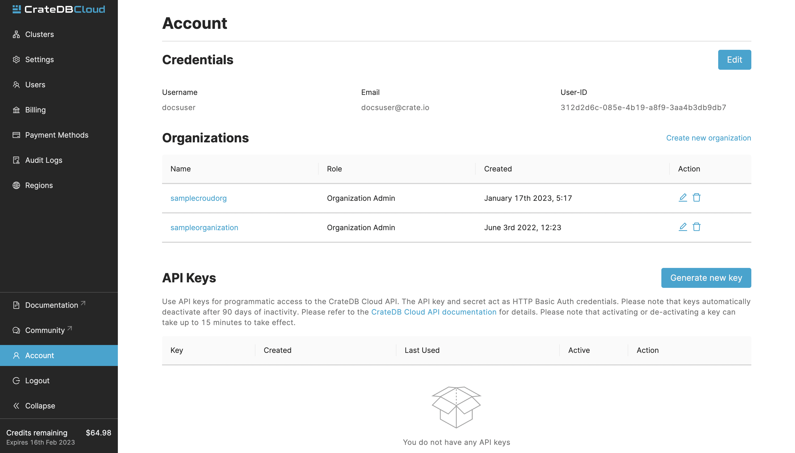

===
API
===

Similar to Croud, we offer an API to allow programmatic access to our Cloud
products. API is operated using a key and a secret. These can be created in
your account page:

Click the *Generate new key* button to create your key. A popup with your
key and secret will appear. Make sure to store your secret safely, as you
cannot access it again. 

Examples
--------

Our API is documented with `Swagger`_. It contains endpoints for:

- Organizations
- Regions
- Projects
- Clusters
- Products
- Users
- Roles
- Subscriptions
- Audit logs
- Metadata
- Free trial credits

It provides example requests with all the required parameters, expected
responses, and all response codes. Access the API documentation `here`_.

.. _Swagger: https://console.cratedb.cloud/api/docs
.. _here: https://console.cratedb.cloud/api/docs