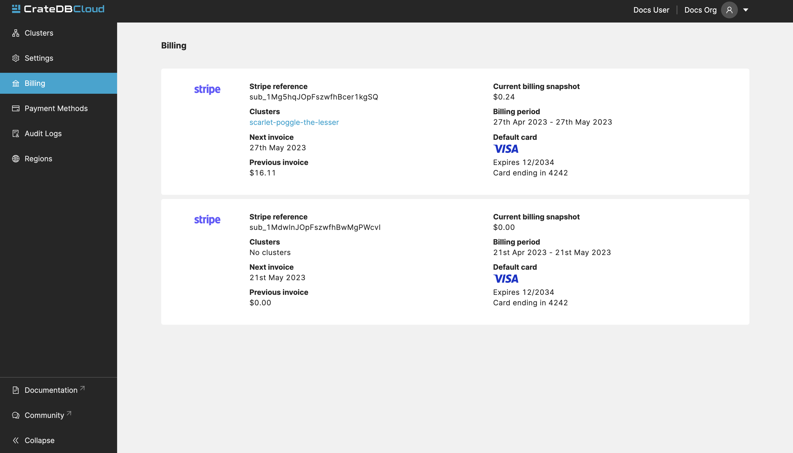
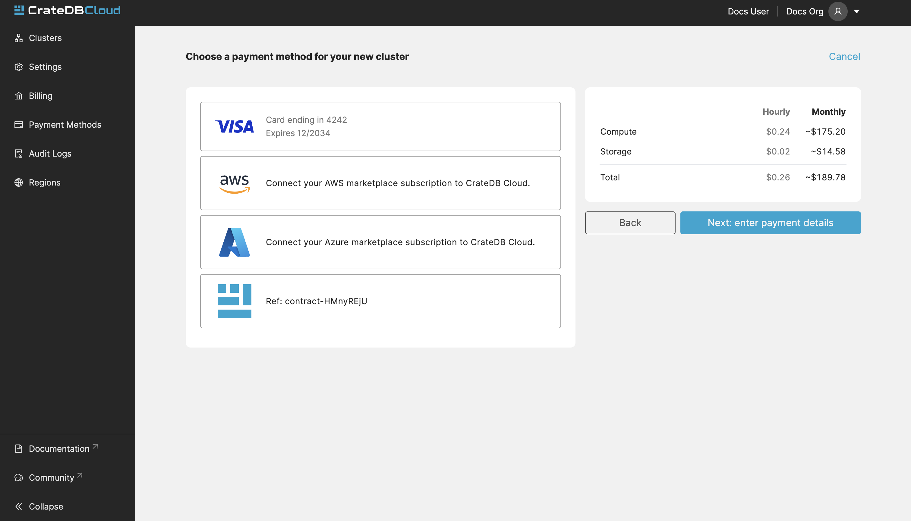

.. _billing:

=======
Billing
=======

This page documents the way billing and related subjects are handled by CrateDB
Cloud. Since - depending on your chosen offer - billing and payment forms may
appear in different places across the CrateDB Cloud interface, this guide
should function as a single reference document for finding the information you
need about billing, invoicing, and payments.

Your current accumulated bill can be always found under the billing tab in
Organization section:

.. _billing-principles:

Billing principles
==================

CrateDB Cloud has three general principles for billing. Firstly, we only ever
bill actual usage of any of our services. This means there are no flat fees or
minimum payments.

Secondly, we only bill for a given period. This means any usage costs are
rounded up to the nearest hour of use for Marketplace customers and to the
nearest minute of use for customers directly deploying via the CrateDB Cloud
Console.

Thirdly, we measure usage either directly, via your Stripe subscription, or
(if you subscribed via one of the SaaS Marktplaces) based on Database
Transaction Units (DTUs). These units represent a given combination of hardware
and storage capabilities for a given subscription plan. They function as
preconfigured usage units to make tracking your usage more convenient. This
means the price you pay for any
:ref:`subscription plan <gloss-subscription-plan>` is expressed as the cost of
a given number of DTUs per minute or hour (as explained above). For more
details about DTUs, see :ref:`our explanation of subscription plans
<subscription-plans-dtus>`.

.. _billing-info:

Billing information & Payment methods
=====================================

Your billing information consists of your (company) address, credit card
details, country of residence, VAT info, and so forth. This information can be
filled out whenever you make use of an offer on CrateDB Cloud that is not free
(when you only use a free offer, the billing info page will not be visible to
you). There are several ways you can provide the necessary billing information:

* You can add a new payment method even without deploying a new cluster. Simply
  navigate to the payment methods tab in the Organization section. You can then
  use this payment method when deploying a cluster later.
* As part of deploying a cluster for a new organization. If you deploy a
  cluster that is not free, you will be prompted for your billing information
  as part of the configuration wizard.
* By using the Billing tab in the Organization overview of the CrateDB Cloud
  Console. If you have a promoted cluster deployed and the free period expires,
  you can find the Billing tab by going to the Organization overview and
  clicking the fifth tab from the left. Here you can enter your billing details
  and your billing method (credit card). See the :ref:`CrateDB Console
  walkthrough <overview-org-billing>` for more information.

Address information, along with the payment methods can be edited in the
payment methods tab, in Organization section:

.. image:: _assets/img/payment-methods2.png
   :alt: Cloud Console payment methods

.. _billing-invoicing:

Invoicing
=========

Invoicing is handled variously depending on which deployment method you use.
If you deploy your cluster directly via the CrateDB Cloud Console, you will be
invoiced at the email address you provided on :ref:`signing up with CrateDB
Cloud <cloud-tutorials:sign-up>`.

If you use one of the marketplace offers, the invoicing is handled by the
marketplace provider in question and will be part of your general invoicing for
services via that marketplace.

Currently, for direct deployments, VAT charges for EU customers are handled by
Crate.io and are added to the invoices described above. For deployments via the
marketplaces, any VAT charges due are handled by the respective marketplace
owners (Microsoft Azure and AWS).

.. _billing-custom-contract:

Custom contract
===============

Crate also offers a special type of payment method suited for large customers
that don't want to use a credit card or marketplace subscriptions (AWS/Azure).
With this type of subscription, a contract is created directly with Crate.

.. NOTE::
    This type of payment method does not show up in your Cloud console
    automatically as it needs to be configured specifically for every
    customer.
    
    If you're interested in this option, don't hesitate and contact us at
    **sales@crate.io**

.. _billing-processing:

Payment processing
==================

For clusters deployed in the :ref:`regular way
<cloud-tutorials:cluster-deployment-stripe>`, using our CrateDB Console cluster
deployment route, payment processing is handled by `Stripe`_. For clusters
deployed through the `Microsoft Azure Marketplace`_ and the `AWS Marketplace`_,
payment is handled by Stripe on behalf of the respective marketplaces.

.. _AWS Marketplace: https://aws.amazon.com/marketplace/pp/B089M4B1ND
.. _Microsoft Azure Marketplace: https://portal.azure.com/#create/crate.cratedbcloud/preview
.. _Stripe: https://stripe.com/
