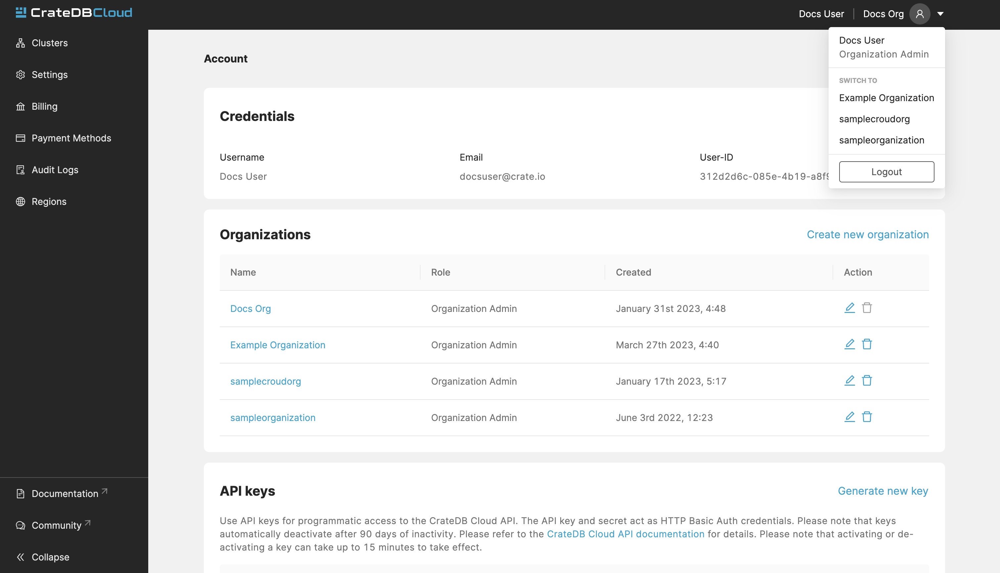
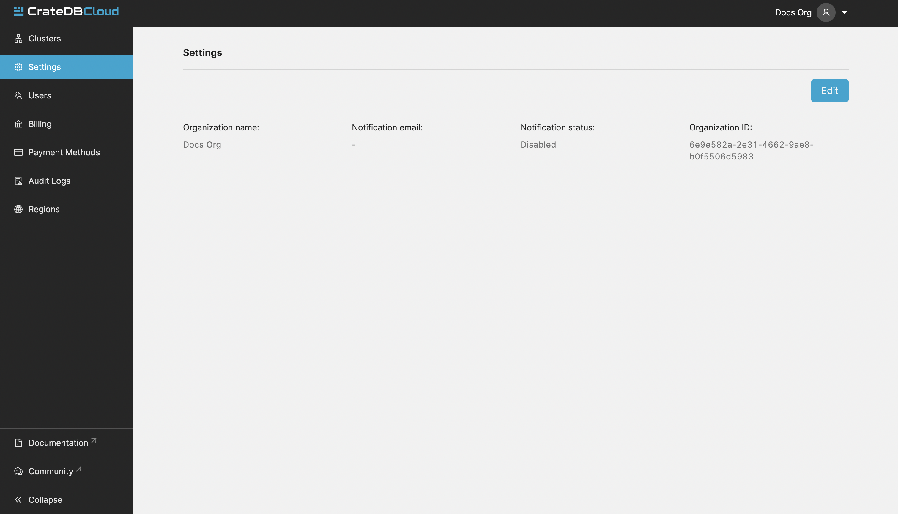
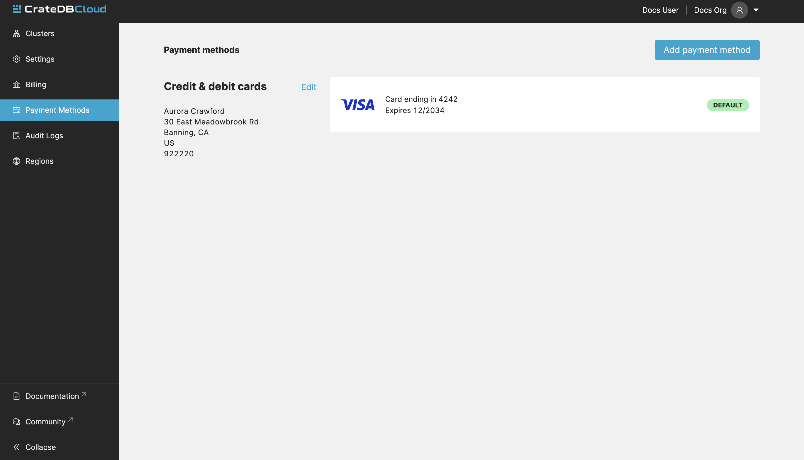
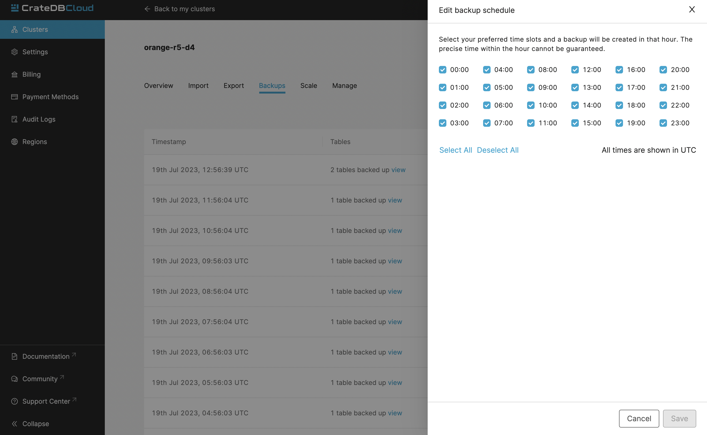
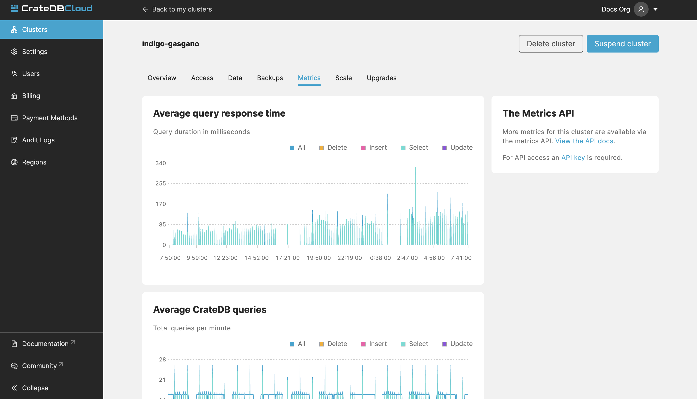
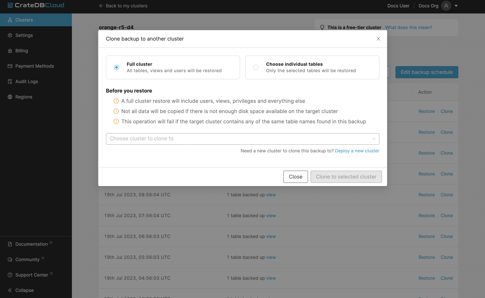

.. _overview:

================
Console overview
================

The *CrateDB Cloud Console* is a hosted web administration interface for
interacting with `CrateDB Cloud`_. This overview gives you all the basic
information for using the CrateDB Cloud Console. If you ever want to find
where and how to do something in the Console, start here. Refer to individual
items in the current section of the documentation for more information on how
to perform specific operations. You can also refer to our `glossary`_ for more
information on CrateDB Cloud-related terminology.

.. rubric:: Table of contents

.. contents::
   :local:

.. _overview-basics:

Basics
======

.. image:: _assets/img/start.png
   :alt: CrateDB Cloud sign-in screen

The CrateDB Cloud user interface permalink is the `CrateDB Cloud Console`_.
You can `deploy a trial cluster on the CrateDB Cloud Console for free`_.

Here is a list of all currently available regions for CrateDB Cloud:

+-------------------+----------------------------------------+
| Region            | URL                                    |
+===================+========================================+
| AWS West Europe   | `eks1.eu-west-1.aws.cratedb.cloud`_    |
+-------------------+----------------------------------------+
| Azure East-US2    | `aks1.eastus2.azure.cratedb.cloud`_    |
+-------------------+----------------------------------------+
| Azure West Europe | `aks1.westeurope.azure.cratedb.cloud`_ |
+-------------------+----------------------------------------+

Azure East-US2 and Azure West-Europe are managed by `Microsoft Azure`_. The
AWS region is managed by AWS and is located in Ireland. Note that the AWS
region does not serve the CrateDB Cloud Console directly.

From the Cloud Console homepage, you can sign in using a Github, Google, or
Microsoft Azure account or by creating a separate username and password.

If you don't have a Cloud Console account yet, follow the steps in the `signup
tutorial`_. Select the authentication method you wish to use. From there, you
will be given the option to sign up.

Once signed in, you will be presented with the Organization overview.

.. _overview-org-overview:

Organization
============

The Organization overview lists the organizations you can access.
For the first-time users, an organization called "My organization" is 
automatically crated upon first login.

If you follow the `tutorial`_ instructions and deploy a test cluster, your
Organization overview will look something like this:

The Organization overview consists of seven tabs: *Dashboard*, *Settings*,
*Users*, the *Audit Log*, *Billing*, *Payment Methods*, and finally,
*Regions*. By default it shows the Dashboard tab, which displays two things.
On the left, it shows a link for creating a new cluster, the blue *Deploy new
cluster* button. On the right, you will see any already deployed clusters.

The *Deploy cluster* button in the left panel allows you to directly deploy
clusters within your subscription. For information on how to do so, refer to
`our tutorial on direct cluster deployment`_.

If you are a member of multiple organizations, you can find them in a dropdown
menu at the top right of the Organization overview. The CrateDB Cloud Console
is structured on a per-organization basis: all pages and tabs in the Console
will display values for the organization you select here.

You can access the other tabs by clicking their respective names at the top.

.. _overview-org-settings:

Organization Settings
---------------------

The Settings tab shows you the name, ID, and notification settings for your
currently selected organization.

By clicking the *Edit* button next to the organization, you can rename it. 
Here you can also set the email address for notifications and indicate whether
you want to receive them or not. To create or delete organizations, or to
switch organization, go to your :ref:`Account <overview-account>` instead.

.. _overview-org-users:

Organization Users
------------------

The Users tab shows the users associated with the organization, as well as
their user role and their email address.

.. image:: _assets/img/organization-users.png
   :alt: Cloud Console organization users tab

If you are an organization admin, you can edit these by clicking the pen icon
or delete users by using the bin icon. To add new users to the organization,
in this tab, click the *Add user* button in the top right. In the popup menu,
you can add users by ID or by email address. If they are not yet a member of
your organization, they will receive an email invitation to do so.

.. image:: _assets/img/organization-users-email.png
   :alt: Cloud Console organization users invitation via email

To learn more about user roles and their meaning, see our documentation on
`user roles`_.

.. _overview-org-audit:

Organization Audit Log
----------------------

This tab shows the Audit Log.

.. image:: _assets/img/organization-audit-log.png
   :alt: Cloud Console organization audit log tab

In the Audit Log, a user with the correct credentials (`an organization
admin`_) can see an overview of logged changes to the organization.

.. _overview-org-billing:

Organization Billing
--------------------

This tab shows all your existing subscriptions, along with which cluster is
currently using the subscription. Current accumulated billing snapshot is also
visible here, along with additional information:

.. image:: _assets/img/billing-meter.png
   :alt: Cloud Console billing meter

.. NOTE::
    Subscriptions cannot be deleted in the billing tab. To delete a
    subscription, please contact support.

Organization payment methods
----------------------------

This tab shows all the information about your payment methods. If you have
signed up with a credit card for your cluster (the recommended route), your
card information overview will be shown here.

In case you use multiple cards, a default card can be set and cards can be
deleted from the list by using the dots icon to the right of the card listing.
Click the *Add payment method* button at the top right to add a new card.

Cloud subscription payment methods can also be added here.

.. _overview-org-regions:

Organization Regions
--------------------

In this tab, you will see the available :ref:`regions <gloss-region>` for
cluster deployment. It is possible to deploy clusters on this screen as well,
by clicking the *Deploy cluster* button under each respective region field.

.. image:: _assets/img/organization-regions.png
   :alt: Cloud Console organization regions tab

For those with access to `CrateDB Edge`_, This tab also allows the deployment
of :ref:`CrateDB Edge <gloss-edge>` clusters in a :ref:`custom region
<gloss-region>`. To do so, provide a name for the custom region and click the
*Create edge region* button. Once created, the custom region will appear:

.. image:: _assets/img/organization-regions-edge.png
   :alt: Cloud Console organization edge region display

This field will show a script to set up the dependencies for cluster
deployment in the custom region. Apply the script in your local CLI and follow
the prompts to proceed. A ``--help`` parameter is available within the script
for further information.

.. _overview-org-subscriptions:

Organization Subscriptions
--------------------------

In the Subscriptions tab you can create new subscriptions with one of our
supported cloud providers, Microsoft Azure and AWS. In the panel, choose
either *Microsoft Azure* or *Amazon AWS* to create a new subscription with
that respective provider.

.. image:: _assets/img/organization-subscriptions.png
   :alt: Cloud Console organization subscriptions tab

.. _overview-cluster-overview:

Cluster Overview
----------------

The Cluster Overview page gives a broad range of relevant data for the cluster
selected. It also displays metrics for the cluster.

.. image:: _assets/img/cluster-overview.png
   :alt: Cloud Console cluster overview page

Info
''''

The column on the left hand side, under the cluster logo and name, displays
information about the cluster. This includes:

* **Cluster ID**: The unique ID of the cluster.

* **Status**: The status of the cluster. This can be 'available', 'not
  available', or 'setting up cluster'.

* **Access cluster**: The *open cluster administration* button connects you to
  the `CrateDB Admin UI`_ for the cluster at its unique URL. Alternatively,
  you can follow the link *how to connect* to the cluster to find various
  helpful code snippets for connecting to the cluster via a terminal or
  client.

.. NOTE::

    The Cluster URL points to a load balancer that distributes traffic
    internally to the whole CrateDB cluster. The load balancer closes idle
    connections after four minutes, therefore client applications that require
    stateful connections (e.g., JDBC) must be configured to send keep-alive
    heartbeat queries.

* **Cluster Demo Data**: Follow this link to quickly set up demo data for your
  cluster. This will demonstrate in an easy way how it can be used in
  practice.

* **Version**: This indicates the version number of CrateDB the cluster is
  running.

* **Date created**: The day of the original deployment of the cluster.

* **DB Username**: This shows once more the username associated with the
  cluster. You chose this username while setting up the cluster originally.

* **Plan**: This shows what subscription plan the cluster is running on. For
  more information on our plans, see the documentation on
  `subscription plans`_.

* **Subscription**: The name of the subscription itself, with a link to the
  :ref:`Subscriptions tab of the Organization page<overview-org-overview>`.

For more information on the CrateDB concepts used here, refer to the `CrateDB
architecture documentation`_ or the :ref:`glossary<glossary>`.

.. _overview-cluster-overview-metrics:

Configuration, Usage, and Metrics
~~~~~~~~~~~~~~~~~~~~~~~~~~~~~~~~~

On the rest of the page you will find various cluster metrics. In the center
you will see an overview of general usage in the past week, including storage,
memory, and CPU usage. A bar at the top indicates the 85% mark: if your CPU or
storage usage is above this percentage of the cluster capacity, you should
consider upgrading by `scaling the cluster`_.

On the right you will see more immediate metrics, collected from the last hour
of cluster operations. This includes average queries, average query response
time, and disk, memory, and CPU usage for the last hour.

The queries and query response time of the cluster can be seen in more detail
on the Cluster Metrics page, for which see below. This page can also be
accessed by clicking the *View metrics* link at the top right.

.. _overview-cluster-backups:

Cluster Backups
---------------

You can find the Backups page in the detailed view of your cluster. By
default, a backup is made every hour. You can see and restore all existing
backups here.

.. image:: _assets/img/cluster-backups.png
   :alt: Cloud Console cluster backups page

You can also control the schedule of your backups by clicking the *Edit backup
schedule* button.

Here you can create a custom schedule by selecting any number of hour slots.
Backups will be created at selected times. At least one backup a day is
mandatory.

To restore a particular backup, click the *Restore* button. A popup window
with a SQL statement will appear. Input this statement to your Admin UI
console eitheir by copy-pasting it, or clicking the *Run query in Admin UI*.
The latter will bring you directly to the Admin UI console with the statement
automatically pre-filled.

.. image:: _assets/img/cluster-backups-restore.png
   :alt: Cloud Console cluster backups restore page 

.. _overview-cluster-metrics:

Cluster Metrics
---------------

The Cluster Metrics page (not to be confused with the :ref:`metrics section of
the Cluster overview page <overview-cluster-overview-metrics>`) provides live
visualizations of how the cluster is functioning. It shows two graph panels:
one for the average response time of a query (in milliseconds) and one for the
total number of queries per second.

The contributions of each type of query to the total results displayed in the
graph panel are displayed in different colors. These values can also be read
directly by hovering over the relevant point on the time axis (the X axis).

.. _overview-cluster-cloning:

Cluster Cloning
---------------

Cluster cloning is a process of duplicating all the data from a
specific snapshot into a different cluster. Creating the new cluster isn't
part of the cloning process, you need to create a target cluster yourself. You
can clone a cluster from the Backups page. 

.. image:: _assets/img/cluster-backups.png
   :alt: Cloud Console cluster backup snapshots

Choose a snapshot and click the *Clone* button. A popup window will appear,
where you can specify to which existing cluster the snapshot should be cloned.
If you don't have a second cluster created, click the *Deploy a new cluster*
button, and you will be brought to the cluster deployment screen. After you've
selected a cluster, click the *Clone to selected cluster*. 

.. NOTE::

    Keep in mind that cloning a cluster will rewrite the all existing users
    from the target cluster. The tables already existing on the target cluster
    are not affected. Cloning also doesn't distinguish between cluster plans,
    meaning you can clone from CR2 to CR1 or any other variation.

.. _overview-cluster-cloning-fail:

Failed cloning
''''''''''''''

There are circumstances under which cloning can fail. These are:

* If you already have tables with the same names in the target cluster
  as in the source snapshot, the entire clone operation will fail.

* There isn't enough storage left on the target cluster to accommodate the
  tables you're trying to clone.

* You're trying to clone an invalid or no longer existing snapshot. This can
  happen if you're cloning through `Croud`_.

* You're trying to restore a table that is not included in the snapshot. This
  can happen if you're restoring snapshots through `Croud`_.

When cloning fails, it is indicated by a banner in the cluster overview
screen.

.. image:: _assets/img/cluster-clone-failed.png
   :alt: Cloud Console cluster failed cloning

.. _overview-cluster-settings:

Cluster Preferences
-------------------

The Cluster Preferences page has three tabs: Cluster Access, Cluster Scale,
and Upgrade Cluster. The default tab, Cluster Access, shows you the username
and password you defined to access your cluster directly. By clicking *Edit*
at the top right, you can change the password (but not the username).

.. image:: _assets/img/cluster-settings.png
   :alt: Cloud Console cluster preferences page

Deletion protection
'''''''''''''''''''

Below the username and password, you will find a tickbox for "Cluster
Security".

Click the box labelled *Deletion Protected* to add deletion protection to your
cluster. This will ensure that it can only be deleted in either the CrateDB
Console or croud by a user with :ref:`org admin rights <org-roles>` (or by a
Crate.io employee superuser).

Allowlist
'''''''''

By using the IP allowlisting feature, you can restrict access to your cluster
to an indicated IP address or `CIDR block`_. Click the blue *Add
Address* button and you can fill out an IP address or range and give it a
meaningful description. Click *Save* to store it or the bin icon to delete a
range. Keep in mind that once IP allowlisting has been set, you cannot access
the Admin UI for that cluster from any other address.

.. image:: _assets/img/cluster-settings-allowlist.png
   :alt: Cloud Console cluster preferences IP allowlisting option

If no allowlist address or address range is set, the cluster is publicly
accessible by default. (Of course, the normal authentication procedures are
always required.) Only an :ref:`org admin <org-roles>` can change the
allowlist.

.. _overview-cluster-settings-scale:

Cluster Scale
'''''''''''''

The blue box on the left shows the current cluster subscription plan. The
scale unit can be adjusted on this page, and the storage capacity can be
increased here.

.. image:: _assets/img/cluster-settings-scale.png
   :alt: Cloud Console cluster scaling tab

You can scale your cluster here by using the slider under the Cluster Scale
panel. The cluster capacity indicated will change accordingly.

.. NOTE::

    Any promotions or discounts applicable to your cluster will be applied for
    your organization as a whole at the end of the billing period. Due to
    technical limitations, they may not be directly visible in the cluster
    scale pricing shown here, but do not worry! This does not mean that your
    promotion or discount is not functioning.

You can also increase the storage capacity on your cluster. Do this by
clicking *Edit cluster configuration* at the top right. A dropdown menu will
appear under the 'Storage' item of the node specification:

.. image:: _assets/img/cluster-settings-storage.png
   :alt: Cloud Console cluster custom storage dropdown

Pick the desired storage capacity. You will see the footer indicating the new
cluster price appear. When you are satisfied, hit *Save* at the top right
again to confirm.

.. WARNING::

    Storage capacity increases for a given cluster are irreversible. To reduce
    cluster storage capacity, reduce the cluster nodes instead (up to a
    minimum of 2, although we recommend maintaining a minimum of 3 for
    production use).

.. _overview-cluster-settings-delete:

Delete cluster
''''''''''''''

You can also delete your cluster in either tab of the Cluster Preferences by
clicking the *Delete cluster* button at the top right. It will prompt you for
confirmation.

.. WARNING::

    All cluster data will be lost on deletion. This action cannot be undone.

.. _overview-cluster-settings-upgrade:

Upgrade cluster
'''''''''''''''

The Upgrade cluster tab shows two things: the current version of the cluster
and, if a :ref:`minor upgrade <gloss-version>` or
:ref:`patch upgrade <gloss-version>` is possible, a list of available
upgrades. If no upgrade is possible, because the cluster is up to date with 
the latest version of CrateDB, nothing will be displayed in the Available
Upgrades panel. You can upgrade a cluster from the Available Upgrades panel by
clicking the *Upgrade* button on the right. Upgrading may take a brief moment,
during which other cluster operations will be disabled.

.. image:: _assets/img/cluster-settings-upgrade.png
   :alt: Cloud Console cluster preferences upgrade tab

For more information on your current version and its feature changes, you can
click the document icon at the far right of the version number.

Major upgrades of CrateDB are carried out for CrateDB Cloud customers by the
CrateDB Cloud engineering team.

.. NOTE::

    Using the upgrade method in the CrateDB Cloud Console, you can only
    upgrade one minor version at a time, and only to the latest or last patch
    version of a given minor version. (Upgrades to other patch versions are
    possible using `Croud clusters upgrade`_.) Downgrades are never supported.

.. _overview-docs:

Documentation
=============

The Documentation link takes you directly to the CrateDB Cloud documentation,
which you are reading right now!

.. _overview-community:

Community
=========

The Community link goes to the `CrateDB and CrateDB Cloud Community page`_.
Here you can ask members of the community and Crate.io employees questions
about uncertainties or problems you are having when using our products.

.. _overview-account:

Account
=======

The Account page shows the current account you are using to interact with the
CrateDB Cloud Console. It shows the username as well as the email address
associated with that username. It also shows a list of all organizations you
are involved in, with your :ref:`user role <user-roles>` and the date of its
creation.

.. image:: _assets/img/account.png
   :alt: Cloud Console account

The latter can be edited in this screen by clicking the *Edit* button at the
top right.

You can also create and delete organizations on the Account page. To create a
new organization, click on *Create new organization* at the top right above
the organization list. The `organization creation process`_ is then the same
as when you first sign up for the CrateDB Cloud Console. To delete an
organization, click the trashcan icon next to the organization in the list.

To switch the active organization, click on the organization name in the list.
All organization, and cluster management options displayed in the CrateDB
Cloud Console will then refer to that organization until you switch
organizations again.

.. _overview-logout:

Logout
======

Use the *Logout* button to log out of your current account and leave the
CrateDB Cloud Console.

.. _aks1.eastus2.azure.cratedb.cloud: https://eastus2.azure.cratedb.cloud/
.. _eks1.eu-west-1.aws.cratedb.cloud: https://eks1.eu-west-1.aws.cratedb.cloud
.. _aks1.westeurope.azure.cratedb.cloud: https://aks1.westeurope.azure.cratedb.cloud/
.. _an organization admin: https://crate.io/docs/cloud/reference/en/latest/user-roles.html#organization-roles
.. _bregenz.a1.cratedb.cloud: https://bregenz.a1.cratedb.cloud/
.. _CIDR block: https://www.keycdn.com/support/what-is-cidr
.. _concepts: https://crate.io/docs/cloud/reference/en/latest/concepts.html
.. _CrateDB Admin UI: https://crate.io/docs/clients/admin-ui/
.. _CrateDB and CrateDB Cloud Community page: https://community.crate.io/
.. _CrateDB architecture documentation: https://crate.io/docs/crate/howtos/en/latest/architecture/shared-nothing.html
.. _CrateDB Cloud: https://crate.io/products/cratedb-cloud/
.. _CrateDB Cloud Console: https://console.cratedb.cloud
.. _CrateDB Cloud support: support@crate.io
.. _CrateDB Edge: https://crate.io/products/cratedb-edge/
.. _CrateDB Edge region: https://crate.io/docs/cloud/tutorials/en/latest/edge/index.html
.. _Croud: https://crate.io/docs/cloud/cli/en/latest/
.. _Croud clusters upgrade: https://crate.io/docs/cloud/cli/en/latest/commands/clusters.html#clusters-upgrade
.. _deploy a trial cluster on the CrateDB Cloud Console for free: https://crate.io/lp-free-trial
.. _glossary: https://crate.io/docs/cloud/reference/en/latest/glossary.html
.. _HTTP: https://crate.io/docs/crate/reference/en/latest/interfaces/http.html
.. _Microsoft Azure: https://azure.microsoft.com/en-us/
.. _organization creation process: https://crate.io/docs/cloud/howtos/en/latest/create-org.html
.. _our tutorial on direct cluster deployment: https://crate.io/docs/cloud/tutorials/en/latest/cluster-deployment/stripe.html
.. _PostgreSQL wire protocol: https://crate.io/docs/crate/reference/en/latest/interfaces/postgres.html
.. _scaling the cluster: https://crate.io/docs/cloud/howtos/en/latest/scale-cluster.html
.. _signup tutorial: https://crate.io/docs/cloud/tutorials/en/latest/sign-up.html
.. _subscription plans: https://crate.io/docs/cloud/reference/en/latest/subscription-plans.html
.. _tutorial: https://crate.io/docs/cloud/tutorials/en/latest/cluster-deployment/index.html
.. _user roles: https://crate.io/docs/cloud/reference/en/latest/user-roles.html