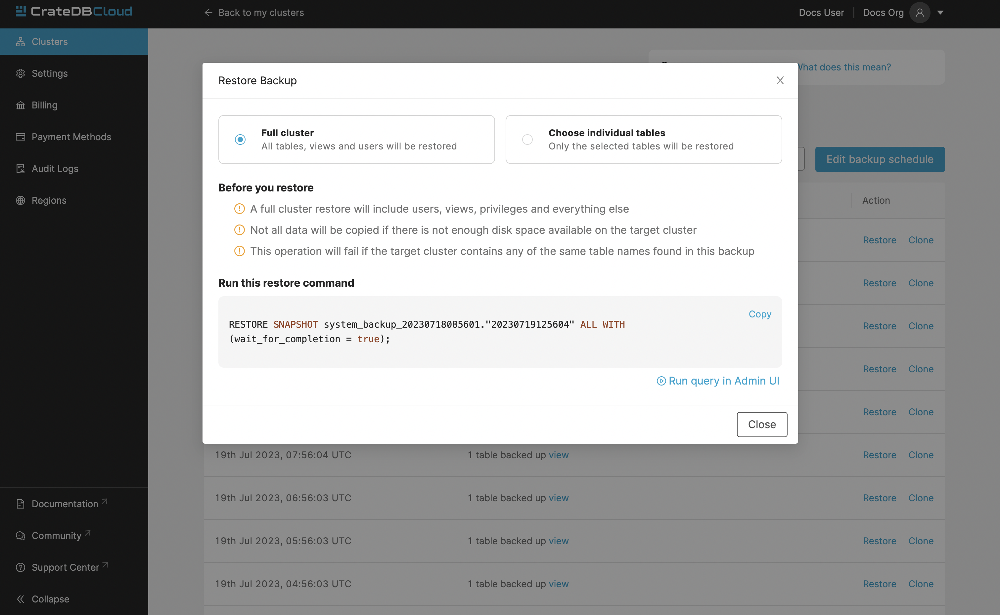
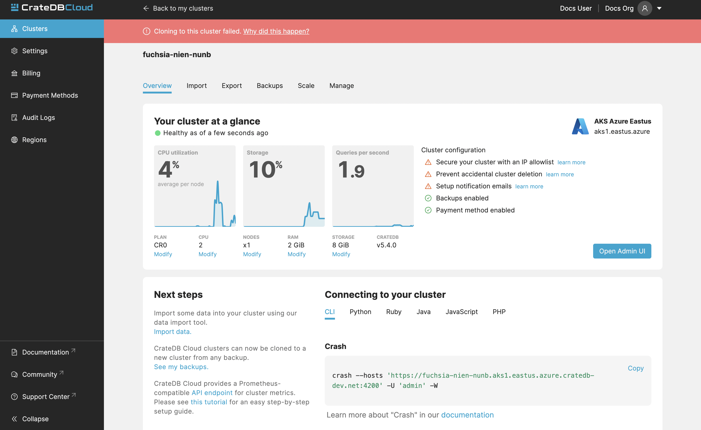
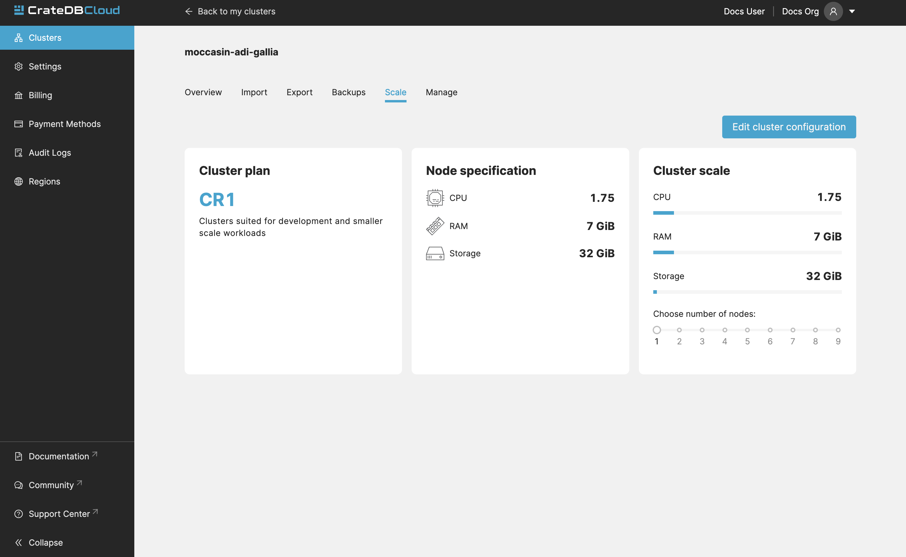
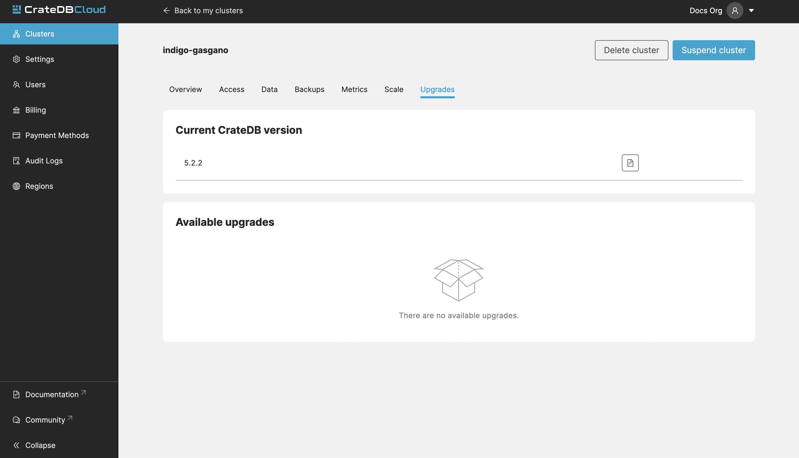

.. _overview:

================
Console overview
================

The *CrateDB Cloud Console* is a hosted web administration interface for
interacting with `CrateDB Cloud`_. This overview gives you all the basic
information for using the CrateDB Cloud Console. If you ever want to find
where and how to do something in the Console, start here. Refer to individual
items in the current section of the documentation for more information on how
to perform specific operations. You can also refer to our `glossary`_ for more
information on CrateDB Cloud-related terminology.

.. rubric:: Table of contents

.. contents::
   :local:

.. _overview-basics:

Basics
======

The CrateDB Cloud user interface permalink is the `CrateDB Cloud Console`_.
You can `deploy a trial cluster on the CrateDB Cloud Console for free`_.

Here is a list of all currently available regions for CrateDB Cloud:

+-------------------+----------------------------------------+
| Region            | URL                                    |
+===================+========================================+
| AWS West Europe   | `eks1.eu-west-1.aws.cratedb.cloud`_    |
+-------------------+----------------------------------------+
| Azure East-US2    | `aks1.eastus2.azure.cratedb.cloud`_    |
+-------------------+----------------------------------------+
| Azure West Europe | `aks1.westeurope.azure.cratedb.cloud`_ |
+-------------------+----------------------------------------+

Azure East-US2 and Azure West-Europe are managed by `Microsoft Azure`_. The
AWS region is managed by AWS and is located in Ireland. Note that the AWS
region does not serve the CrateDB Cloud Console directly.

From the Cloud Console homepage, you can sign in using a Github, Google, or
Microsoft Azure account or by creating a separate username and password.

If you don't have a Cloud Console account yet, follow the steps in the `signup
tutorial`_. Select the authentication method you wish to use. From there, you
will be given the option to sign up.

Once signed in, you will be presented with the Organization overview.

.. _overview-org-overview:

Organization
============

The organization is the highest structure in your CrateDB Cloud Console.
Multiple clusters and users can exist in a organization at any moment. For 
first-time users, an organization called "My organization" is automatically 
created upon first login.

To see list of all the clusters in your organization, go to the Account
tab in your left-hand menu:

.. image:: _assets/img/organization-dashboard.png
   :alt: Cloud Console organization overview

The Organization overview consists of seven tabs: *Clusters*, *Settings*,
*Users*, *Billing*, *Payment Methods*, *Audit Logs*, and *Regions*. By default
you are brought to the Clusters tab, which provides a quick overview of all
your clusters.

If you are a member of multiple organizations, you can quickly change
between them on every tab/page in the Cloud Console. Simply use the
dropdown menu at the top right of the current page/tab: 

.. image:: _assets/img/change-organization.png
   :alt: Cloud Console quick org swap

The CrateDB Cloud Console is structured on a per-organization basis: all pages
and tabs in the Console will display values for the currently selected
organization.

.. _overview-org-settings:

Organization Settings
---------------------

The Settings tab shows you the name, notification settings, and ID of your
currently selected organization.

.. image:: _assets/img/organization-settings.png
   :alt: Cloud Console organization settings tab

By clicking the *Edit* button next to the organization, you can rename it. 
Here you can also set the email address for notifications and indicate whether
you want to receive them or not. 

.. _overview-org-users:

Organization Users
------------------

The Users tab shows the users associated with the organization, as well as
their user role and their email address.

.. image:: _assets/img/organization-users.png
   :alt: Cloud Console organization users tab

If you are an organization admin, you can edit these by clicking the pen icon
or delete users by using the bin icon. To add new users to the organization,
in this tab, click the *Add user* button in the top right. In the popup menu,
you can add users by ID or by email address. If they are not yet a member of
your organization, they will receive an email invitation to do so.

.. image:: _assets/img/organization-users-email.png
   :alt: Cloud Console organization users invitation via email

To learn more about user roles and their meaning, see our documentation on
`user roles`_.

.. _overview-org-billing:

Organization Billing
--------------------

The Billing tab shows all your existing subscriptions, along with which
cluster is currently using the subscription. The current accumulated billing
snapshot is also visible here, along with additional information:

.. image:: _assets/img/billing-meter.png
   :alt: Cloud Console billing meter

.. NOTE::
    Subscriptions cannot be deleted in the billing tab. To delete a
    subscription, please contact support.

.. _overview-org-payment-methofs:

Organization payment methods
----------------------------

This tab shows all the information about your payment methods. If you have
signed up with a credit card for your cluster (the recommended route), your
card information overview will be shown here.

In case you use multiple cards, a default card can be set and cards can be
deleted from the list by using the dots icon to the right of the card listing.
Click the *Add payment method* button at the top right to add a new card.

Cloud subscription payment methods can also be added here.

.. image:: _assets/img/payment-methods2.png
   :alt: Cloud Console payment methods

.. _overview-org-audit:

Organization Audit Logs
-----------------------

This tab shows the Audit Logs of the current organization.

.. image:: _assets/img/organization-audit-log.png
   :alt: Cloud Console organization audit log tab

In the Audit Log, a user with the correct credentials (`an organization
admin`_) can see an overview of logged changes to the organization.

.. _overview-org-regions:

Organization Regions
--------------------

In this tab, you will see the available :ref:`regions <gloss-region>` for
cluster deployment. It is possible to deploy clusters on this screen as well,
by clicking the *Deploy cluster* button under each respective region field.

For those with access to `CrateDB Edge`_, This tab also allows the deployment
of :ref:`CrateDB Edge <gloss-edge>` clusters in a :ref:`custom region
<gloss-region>`. To do so, provide a name for the custom region and click the
*Create edge region* button. Once created, the custom region will appear:

.. image:: _assets/img/organization-regions.png
   :alt: Cloud Console organization regions tab

This field will show a script to set up the dependencies for cluster
deployment in the custom region. Apply the script in your local CLI and follow
the prompts to proceed. A ``--help`` parameter is available within the script
for further information.

.. _overview-cluster-overview:

Cluster
=======

The detailed view of Cluster provides a broad range of relevant data of the
selected cluster. It also displays metrics for the cluster. It can be accessed
by clicking "View" on the desired cluster in the Clusters tab.

.. image:: _assets/img/cluster-overview.png
   :alt: Cloud Console cluster overview page

Information visible on the Overview page includes:

Overview
--------

* **Status**: Current status of your cluster:
   
   - GREEN: Your cluster is healthy.
   - YELLOW: Some of your tables have under-replicated shards. Please log in
     to your cluster's Admin UI to check.
   - RED: Some of your tables have missing shards. This can happen if you've
     recently restarted a node. Our support team is already notified and
     investigating the issue.

* **Cluster ID**: The unique ID of the cluster.

* **Region**: Name of the region where the cluster is deployed.

* **Plan**: This shows what subscription plan the cluster is running on. For
  more information on our plans, see the documentation on
  `subscription plans`_.

* **Version**: This indicates the version number of CrateDB the cluster is
  running.

* **Storage metrics**: Used and overall storage of the cluster.

* **Date created**: The day of the original deployment of the cluster.

* **CPU metrics**: Current CPU utilization of the cluster.

* **Number of nodes**: Number of nodes in the cluster.

* **Deletion protection**: Displays whether the deletion protection feature is
  on or off.

.. _overview-cluster-overview-admin-ui:

Admin UI
~~~~~~~~

* **Access cluster**: The *Open Admin UI* button connects you to
  the `CrateDB Admin UI`_ for the cluster at its unique URL.

.. NOTE::

    The Cluster URL points to a load balancer that distributes traffic
    internally to the whole CrateDB cluster. The load balancer closes idle
    connections after four minutes, therefore client applications that require
    stateful connections (e.g., JDBC) must be configured to send keep-alive
    heartbeat queries.

.. _overview-cluster-overview-next-steps:

Next Steps
~~~~~~~~~~

* **Connect to your cluster**: Click the "view code snippets" link to
  see a list of snippets for the available clients and libraries. These
  include: CLI clients, Java, JavaScript, PHP, Python, and Ruby.

* **Demo data**: Clicking the "import the demo data" will show you two
  snippets that can be used in the SQL Console of your Admin UI. The first
  snippet will create a "nyc_taxi" table, and the second one will populate it with our 
  demo dataset.

* **Backups**: The "see my backups" will take you to the Backups tab, where 
  you can see all your backups.

For more information on the CrateDB concepts used here, refer to the `CrateDB
architecture documentation`_ or the :ref:`glossary<glossary>`.

.. _overview-cluster-overview-access:

Access
------

The access tab contains your credentials, security settings, allowlist, and
information about private endpoints.

.. _overview-cluster-overview-credentials:

Credentials
~~~~~~~~~~~

Here you can change your CrateDB database password.

.. _overview-cluster-overview-security:

Security
~~~~~~~~

Click the box labelled *Deletion Protected* to add deletion protection to your
cluster. This will ensure that your cluster cannot be deleted while the
Deletion Protection is turned on.

.. _overview-cluster-overview-allowlist:

Allowlist
~~~~~~~~~

By using the IP allowlisting feature, you can restrict access to your cluster
to an indicated IP address or `CIDR block`_. Click the blue *Add
Address* button and you can fill out an IP address or range and give it a
meaningful description. Click *Save* to store it or the bin icon to delete a
range. Keep in mind that once IP allowlisting has been set, you cannot access
the Admin UI for that cluster from any other address.

If no allowlist address or address range is set, the cluster is publicly
accessible by default. (Of course, the normal authentication procedures are
always required.) Only an :ref:`org admin <org-roles>` can change the
allowlist.

.. _overview-cluster-overview-private-endpoints:

Private endpoints
~~~~~~~~~~~~~~~~~

A private endpoint, or private link, is a mechanism that allows a secure, 
private connection to your cluster. Effectively, it allows you to bypass the
public internet when accessing the environment where your cluster is deployed.
Note that private endpoints don't work accross providers, meaning that if you
want to securely access your AWS cluster, you must do so from within the AWS
environment.

If you're interested in this feature, fill out the provided form by clicking
"Request Private Link".

.. _overview-cluster-backups:

Backups
-------

You can find the Backups page in the detailed view of your cluster. By
default, a backup is made every hour. You can see and restore all existing
backups here.

The Backups tab provides a list of all your backups. By default, a backup is
made every hour.

.. image:: _assets/img/cluster-backups.png
   :alt: Cloud Console cluster backups page

You can also control the schedule of your backups by clicking the *Edit backup
schedule* button.

.. image:: _assets/img/cluster-backups-edit.png
   :alt: Cloud Console cluster backups edit page

Here you can create a custom schedule by selecting any number of hour slots.
Backups will be created at selected times. At least one backup a day is
mandatory.

To restore a particular backup, click the *Restore* button. A popup window
with a SQL statement will appear. Input this statement to your Admin UI
console eitheir by copy-pasting it, or clicking the *Run query in Admin UI*.
The latter will bring you directly to the Admin UI console with the statement
automatically pre-filled.

.. _overview-cluster-cloning:

Cluster Cloning
~~~~~~~~~~~~~~~

Cluster cloning is a process of duplicating all the data from a
specific snapshot into a different cluster. Creating the new cluster isn't
part of the cloning process, you need to create the target cluster yourself. 
You can clone a cluster from the Backups page. 

.. image:: _assets/img/cluster-backups.png
   :alt: Cloud Console cluster backup snapshots

Choose a snapshot and click the *Clone* button. A popup window will appear,
where you can specify to which existing cluster the snapshot should be cloned.
If you don't have a second cluster created, click the *Deploy a new cluster*
button, and you will be brought to the cluster deployment screen. After you've
selected a cluster, click the *Clone to selected cluster*. 

.. image:: _assets/img/cluster-clone-popup.png
   :alt: Cloud Console cluster clone popup

.. NOTE::

    Keep in mind that cloning a cluster will rewrite all the existing users
    from the target cluster. The tables already existing on the target cluster
    are not affected. Cloning also doesn't distinguish between cluster plans,
    meaning you can clone from CR2 to CR1 or any other variation.

.. _overview-cluster-cloning-fail:

Failed cloning
~~~~~~~~~~~~~~

There are circumstances under which cloning can fail or behave unexpectedly.
These are:

* If you already have tables with the same names in the target cluster
  as in the source snapshot, the entire clone operation will fail.

* There isn't enough storage left on the target cluster to accommodate the
  tables you're trying to clone. In this case, you might get an incomplete
  cloning as the cluster will run out of storage.

* You're trying to clone an invalid or no longer existing snapshot. This can
  happen if you're cloning through `Croud`_. In this case, the cloning will
  fail.

* You're trying to restore a table that is not included in the snapshot. This
  can happen if you're restoring snapshots through `Croud`_. In this case, 
  the cloning will fail.

When cloning fails, it is indicated by a banner in the cluster overview
screen.

.. _overview-cluster-overview-metrics:

Metrics
-------

The Metrics tab show shows two graph panels: one for the average response time
of a query (in milliseconds) and one for the total number of queries per
second.

.. image:: _assets/img/cluster-metrics.png
   :alt: Cloud Console cluster metrics page

The contributions of each type of query to the total results displayed in the
graph panel are displayed in different colors. These values can also be read
directly by hovering over the relevant point on the time axis (the X axis).

.. _overview-cluster-settings-scale:

Scale
-----

On the Scale tab, current configuration of your cluster is shown. You can see
your current plan, resources of a single node, and overall resources of the
cluster.

You can scale your cluster by clicking the *Edit cluster configuration* button
in the top-right:

.. image:: _assets/img/cluster-scale-edit.png
   :alt: Cloud Console cluster scaling edit

Now you can do three different things:

- Change the plan of your cluster
- Increase storage on each node
- Icrease/decrease the number of nodes

You can do only one of those operations at a time, i.e. you can't change plans
and scale the number of nodes at the same time.

The difference in price of the cluster can be seen on the bottom right, when
choosing different configurations.

.. NOTE::

    Any promotions or discounts applicable to your cluster will be applied for
    your organization as a whole at the end of the billing period. Due to
    technical limitations, they may not be directly visible in the cluster
    scale pricing shown here, but do not worry! This does not mean that your
    promotion or discount is not functioning.

.. WARNING::

    Storage capacity increases for a given cluster are irreversible. To reduce
    cluster storage capacity, reduce the cluster nodes instead (up to a
    minimum of 2, although we recommend maintaining a minimum of 3 for
    production use).

.. _overview-cluster-upgrade:

Upgrades
--------

The Upgrade cluster tab shows two things: the current version of the cluster
and, if a :ref:`minor upgrade <gloss-version>` or
:ref:`patch upgrade <gloss-version>` is possible, a list of available
upgrades. If no upgrade is possible, because the cluster is up to date with 
the latest version of CrateDB, nothing will be displayed in the Available
Upgrades panel. You can upgrade a cluster from the Available upgrades panel by
clicking the *Upgrade* button next to a specific shown version. Depending on how much data you have in your cluster, upgrading might take a while, during which other cluster operations will be disabled. Your cluster's nodes
will be upgraded one at a time, so your cluster will remain available through the process.

You can also click the document icon next to a listed version. This will bring
you to the release notes of said version.

Major upgrades of CrateDB are carried out for CrateDB Cloud customers by the
CrateDB Cloud engineering team.

.. NOTE::

    Using the upgrade method in the CrateDB Cloud Console, you can only
    upgrade one minor version at a time, and only to the latest or last patch
    version of a given minor version. (Upgrades to other patch versions are
    possible using `Croud clusters upgrade`_.) Downgrades are never supported.

.. _overview-cluster-delete:

Delete cluster
--------------

Clusters can be deleted on any of the Cluster overview tabs, by clicking the
*Delete cluster* button in the top-right.

.. WARNING::

    All cluster data will be lost on deletion. This action cannot be undone.

.. _overview-docs:

Documentation
=============

The Documentation link takes you directly to the CrateDB Cloud documentation,
which you are reading right now!

.. _overview-community:

Community
=========

The Community link goes to the `CrateDB and CrateDB Cloud Community page`_.
Here you can ask members of the community and Crate.io employees questions
about uncertainties or problems you are having when using our products.

.. _overview-account:

Account
=======

The Account page shows the current account you are using to interact with the
CrateDB Cloud Console. It shows the username as well as the email address
associated with that username. It also shows a list of all organizations you
are involved in, with your :ref:`user role <user-roles>` and the date of its
creation.

.. image:: _assets/img/account.png
   :alt: Cloud Console account

The latter can be edited in this screen by clicking the *Edit* button at the
top right.

You can also create and delete organizations on the Account page. To create a
new organization, click on *Create new organization* at the top right above
the organization list. The `organization creation process`_ is then the same
as when you first sign up for the CrateDB Cloud Console. To delete an
organization, click the trashcan icon next to the organization in the list.

To switch the active organization, click on the organization name in the list.
All organization, and cluster management options displayed in the CrateDB
Cloud Console will then refer to that organization until you switch
organizations again.

.. _overview-logout:

Logout
======

Use the *Logout* button to log out of your current account and leave the
CrateDB Cloud Console.

.. _aks1.eastus2.azure.cratedb.cloud: https://eastus2.azure.cratedb.cloud/
.. _eks1.eu-west-1.aws.cratedb.cloud: https://eks1.eu-west-1.aws.cratedb.cloud
.. _aks1.westeurope.azure.cratedb.cloud: https://aks1.westeurope.azure.cratedb.cloud/
.. _an organization admin: https://crate.io/docs/cloud/reference/en/latest/user-roles.html#organization-roles
.. _bregenz.a1.cratedb.cloud: https://bregenz.a1.cratedb.cloud/
.. _CIDR block: https://www.keycdn.com/support/what-is-cidr
.. _concepts: https://crate.io/docs/cloud/reference/en/latest/concepts.html
.. _contact us: https://crate.io/contact
.. _CrateDB Admin UI: https://crate.io/docs/clients/admin-ui/
.. _CrateDB and CrateDB Cloud Community page: https://community.crate.io/
.. _CrateDB architecture documentation: https://crate.io/docs/crate/howtos/en/latest/architecture/shared-nothing.html
.. _CrateDB Cloud: https://crate.io/products/cratedb-cloud/
.. _CrateDB Cloud Console: https://console.cratedb.cloud
.. _CrateDB Cloud support: support@crate.io
.. _CrateDB Edge: https://crate.io/products/cratedb-edge/
.. _CrateDB Edge region: https://crate.io/docs/cloud/tutorials/en/latest/edge/index.html
.. _Croud: https://crate.io/docs/cloud/cli/en/latest/
.. _Croud clusters upgrade: https://crate.io/docs/cloud/cli/en/latest/commands/clusters.html#clusters-upgrade
.. _deploy a trial cluster on the CrateDB Cloud Console for free: https://crate.io/lp-free-trial
.. _glossary: https://crate.io/docs/cloud/reference/en/latest/glossary.html
.. _HTTP: https://crate.io/docs/crate/reference/en/latest/interfaces/http.html
.. _Microsoft Azure: https://azure.microsoft.com/en-us/
.. _organization creation process: https://crate.io/docs/cloud/howtos/en/latest/create-org.html
.. _our tutorial on direct cluster deployment: https://crate.io/docs/cloud/tutorials/en/latest/cluster-deployment/stripe.html
.. _PostgreSQL wire protocol: https://crate.io/docs/crate/reference/en/latest/interfaces/postgres.html
.. _scaling the cluster: https://crate.io/docs/cloud/howtos/en/latest/scale-cluster.html
.. _signup tutorial: https://crate.io/docs/cloud/tutorials/en/latest/sign-up.html
.. _subscription plans: https://crate.io/docs/cloud/reference/en/latest/subscription-plans.html
.. _tutorial: https://crate.io/docs/cloud/tutorials/en/latest/cluster-deployment/index.html
.. _user roles: https://crate.io/docs/cloud/reference/en/latest/user-roles.html