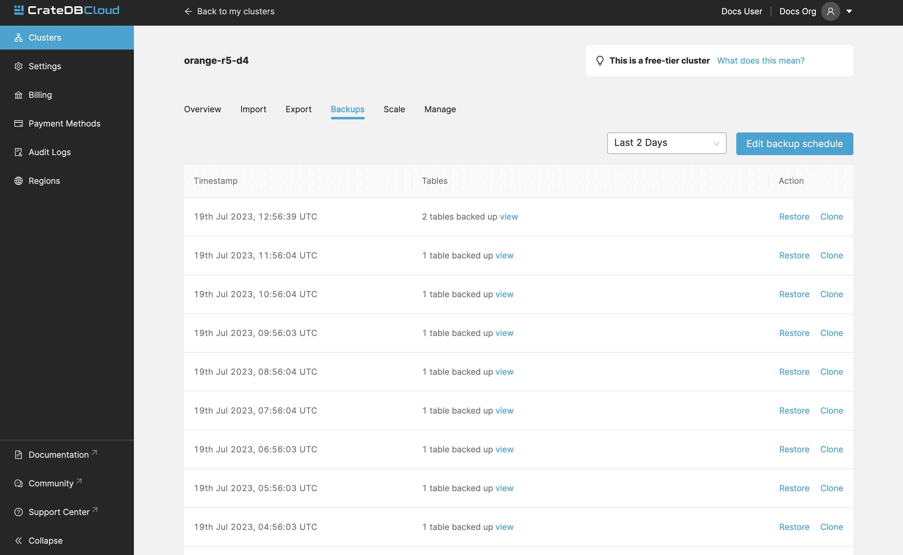

.. _overview:

================
Console overview
================

The *CrateDB Cloud Console* is a hosted web administration interface for
interacting with `CrateDB Cloud`_. This overview gives you all the basic
information for using the CrateDB Cloud Console. Refer to individual items in
the current section of the documentation for more information on how to perform
specific operations. You can also refer to our `glossary`_ for more information
on CrateDB Cloud-related terminology.

.. rubric:: Table of contents

.. contents::
   :local:

.. _overview-basics:

Basics
======

.. image:: _assets/img/start.png
   :alt: CrateDB Cloud sign-in screen

You must access the CrateDB Cloud Console by region.

Here is a list of all currently available regions for CrateDB Cloud:

+-------------------+----------------------------------------+
| Region            | URL                                    |
+===================+========================================+
| AWS West Europe   | `eks1.eu-west-1.aws.cratedb.cloud`_    |
+-------------------+----------------------------------------+
| Azure East-US2    | `aks1.eastus2.azure.cratedb.cloud`_    |
+-------------------+----------------------------------------+
| Azure West Europe | `aks1.westeurope.azure.cratedb.cloud`_ |
+-------------------+----------------------------------------+
| Bregenz           | `bregenz.a1.cratedb.cloud`_            |
+-------------------+----------------------------------------+

Azure East-US2 and Azure West-Europe are managed by `Microsoft Azure`_. The
Bregenz region is managed by Crate.io and is located in Austria. The AWS region
is managed by AWS and is located in Ireland. Note that the AWS region does not
serve the CrateDB Cloud Console directly.

From the Cloud Console homepage, you can sign in using your Cloud Console
username and password (Cognito) or using Microsoft Azure *Active Directory*.

If you don't have a Cloud Console account yet, follow the steps in the `signup
tutorial`_. Select the authentication method you wish to use. From there, you
will be given the option to sign up.

Once signed in, you will be presented with the Organization Overview.

.. _overview-org-overview:

Organization
============

The Organization Overview lists the organizations and projects you can access.

If you follow the `tutorial`_ instructions and deploy a test cluster, your
Organization Overview will look something like this:

.. image:: _assets/img/organization-overview.png
   :alt: Cloud Console organization overview

The Organization Overview consists of six tabs: *Subscriptions*, *Settings*,
*Users*, the *Audit Log*, *Billing*, and finally, *Regions*. By default it
shows the Subscriptions tab, which displays two things. On the left, it shows
the possible cloud providers and a link for creating a subscription with them.
On the right, you will see your current subscription (if any). This panel also
shows subscription details: the status of the subscription, the subscription
ID, the subscription cloud provider, the subscription type, and finally, any
clusters deployed within the subscription with their respective subscription
plans.

The *Deploy cluster* button at the bottom left of any subscription panel allows
you to directly deploy clusters within that subscription. The button with three
dots at the bottom right allows you to cancel that subscription.

You can access the other tabs by clicking their respective names at the top.

Organization Settings
---------------------

The Settings tab shows you naming information (name, ID) and notification
settings for your organization.

.. image:: _assets/img/organization-settings.png
   :alt: Cloud Console organization settings tab

By clicking the *Edit* button next to the organization, you can rename it. Here
you can also set the email address for notifications and indicate whether you
want to receive them or not. By clicking *Delete*, you can delete the
organization.

.. warning::

    You cannot delete an organization without first deleting all projects
    contained within it. Deleting an organization is irreversible.

Organization Users
------------------

The Users tab shows the users associated with the organization, as well as
their user role and their email address.

.. image:: _assets/img/organization-users.png
   :alt: Cloud Console organization users tab

If you are an organization admin, you can edit these by clicking the pen icon
or delete users by using the bin icon. To add new users to the organization, in
this tab, click the *Add user* button in the top right.

To learn more about user roles and their meaning, see our documentation on
`user roles`_.

Organization Audit Log
----------------------

This tab shows the Audit Log.

.. image:: _assets/img/organization-audit-log.png
   :alt: Cloud Console organization audit log tab

In the Audit Log, a user with the correct credentials (`an organization
admin`_) can see an overview of logged changes to the organization, the
organization's projects, and other such data, each provided with a timestamp.

Organization Billing
--------------------

This tab shows the billing overview. If you have signed up with a credit card
for your cluster (the recommended route), your card information overview will
be shown here.

.. image:: _assets/img/organization-billing.png
   :alt: Cloud Console organization billing tab

In case you use multiple cards, a default card can be set and cards can be
deleted from the list by using the dots icon to the right of the card listing.
Click the *Add payment method* button at the top right to add a new card.

On the right-hand side, you will see the billing information. This can be
edited by using the pen icon at the top right.

Organization Regions
--------------------

The Regions tab shows you the currently available regions for cluster
deployment. Each panel shows the region, in other words a server location, and
the corresponding cloud provider or subscription provider responsible for that
region. Below each region panel you will find a button labeled *Deploy
Cluster*. Clicking this will allow you to deploy a cluster directly into that
region.

.. _overview-projects:

Projects
========

The Projects page shows an overview of all current projects within the
organization, together with their timestamp of creation, project ID, and region
of deployment.

.. image:: _assets/img/projects.png
   :alt: Cloud Console projects overview

The projects are selected by region. By default, the region dropdown menu is
set to the region where your project is located (if any). To see projects
deployed in specific regions, select that region from the menu. You can also
create a new project for the organization in the selected region by clicking
the *Create project* button in the top right.

The cog icon next to each project takes you to the Project Settings page, in
the menu simply called Settings, as :ref:`described further below
<overview-project-settings>`.

To change your current project selection, click the project name in the list on
the main Projects page.

.. NOTE::

    The menu bar on the left hand side of the Console is divided in two by a
    line. By design, all menu items below the bar refer to the currently
    selected project, which is visible at the top left. The next sections of
    this documentation are therefore project specific and here referred to as
    "Project Overview", "Project Settings", etc. For elegance of design,
    however, the menu bar simply says "Overview", "Settings", and so forth,
    omitting the 'Project' referent. Nonetheless, these each still refer to the
    project you selected on the Projects page.

.. _overview-projects-overview:

Project Overview
----------------

The Project Overview page provides information about the selected project.
Underneath the project name and icon there is a column on the left hand,
showing the total number of users in the project as well as the share of
members and admins of that total.

.. image:: _assets/img/project-overview.png
   :alt: Cloud Console project overview page

On the right, you see an overview of all clusters deployed within the project.
This shows their status, the subscription plan and tier, the date and timestamp
of their creation, the version of CrateDB they are running, and finally the
subscription name associated with the cluster deployment. Clicking on this
subscription name takes you to the :ref:`Subscriptions tab of the Organization
page<overview-org-overview>`.

Finally, you can also deploy a cluster from within the Project Overview, by
clicking the *Deploy cluster* link at the top right. This also takes you back
to the :ref:`Subscriptions tab of the Organization page
<overview-org-overview>`, from where clusters can be deployed within a given
subscription or a new subscription chosen.

.. _overview-cluster-overview:

Cluster Overview
----------------

The Cluster Overview page gives a broad range of relevant data for the cluster
selected. It also displays metrics for the cluster.

.. image:: _assets/img/cluster-overview.png
   :alt: Cloud Console cluster overview page

Info
~~~~

The column on the left hand side, under the cluster logo and name, displays
information about the cluster. This includes:

* **Cluster ID**: The unique ID of the cluster.

* **Status**: The status of the cluster. This can be 'available', 'not
  available', or 'setting up cluster'.

* **Access cluster**: The *open cluster administration* button connects you to
  the `CrateDB Admin UI`_ for the cluster at its unique URL. Alternatively,
  you can follow the link *how to connect* to the cluster to find various
  helpful code snippets for connecting to the cluster via a terminal or client.

.. NOTE::

    The Cluster URL points to a load balancer that distributes traffic
    internally to the whole CrateDB cluster. The load balancer closes idle
    connections after four minutes, therefore client applications that require
    stateful connections (e.g., JDBC) must be configured to send keep-alive
    heartbeat queries.

* **Cluster demo data**: Follow this link to quickly set up demo data for your
  cluster. This will demonstrate in an easy way how it can be used in practice.

* **Version**: This indicates the version number of CrateDB the cluster is
  running.

* **Date Created**: The day of the original deployment of the cluster.

* **DB Username**: This shows once more the username associated with the
  cluster. You chose this username while setting up the cluster originally.

* **Plan**: This shows what tier of which subscription plan the cluster is
  running on. For more information on our plans, see the documentation on
  `subscription plans`_.

* **Subscription**: The name of the subscription itself, with a link to the
  :ref:`Subscriptions tab of the Organization page<overview-org-overview>`.

For more information on the CrateDB concepts used here, refer to the `CrateDB
architecture documentation`_ or the :ref:`glossary<glossary>`.

.. _overview-cluster-overview-metrics:

Configuration, Usage, and Metrics
~~~~~~~~~~~~~~~~~~~~~~~~~~~~~~~~~

On the rest of the page you will find various cluster metrics. In the center
you will see an overview of general usage in the past week, including storage,
memory, and CPU usage. A bar at the top indicates the 85% mark: if your CPU or
storage usage is above this percentage of the cluster capacity, you should
consider upgrading by `scaling the cluster`_.

On the right you will see more immediate metrics, collected from the last hour
of cluster operations. This includes average queries, average query response
time, and disk, memory, and CPU usage for the last hour.

The queries and query response time of the cluster can be seen in more detail
on the Cluster Metrics page, for which see below. This page can also be
accessed by clicking the *View metrics* link at the top right.

.. _overview-cluster-backups:

Cluster Backups
---------------

On the Cluster Backups page you can see any backups of your cluster. The
dropdown menu at the top left allows you to select the timespan of backups you
want to see.

Any backups are listed with timestamps on the left side, under Timestamp. In
the middle you will see any tables to restore in the backup, under the category
Tables, and on the right is a *Restore* button for restoring the backup from
that timestamp, listed under Action.

.. _overview-cluster-metrics:

Cluster Metrics
---------------

The Cluster Metrics page (not to be confused with the :ref:`metrics section of
the Cluster Overview page <overview-cluster-overview-metrics>`) provides live
visualizations of how the cluster is functioning. It shows two graph panels:
one for the average response time of a query (in milliseconds) and one for the
total number of queries per second.

.. image:: _assets/img/cluster-metrics.png
   :alt: Cloud Console cluster metrics page

The contributions of each type of query to the total results displayed in the
graph panel are displayed in different colors. These values can also be read
directly by hovering over the relevant point on the time axis (the X axis).

.. _overview-cluster-settings:

Cluster Settings
----------------

The Cluster Settings page has two tabs: Cluster Access and Cluster Scale. The
default tab, Cluster Access, shows you the username and password you defined to
access your cluster directly. By clicking *Edit* at the top right, you can
change the password.

.. image:: _assets/img/cluster-settings.png
   :alt: Cloud Console cluster settings page

.. _overview-cluster-settings-scale:

Cluster Scale
~~~~~~~~~~~~~

The blue box on the left shows the current cluster subscription plan, including
the tier and the scale unit. The scale unit can also be adjusted on this page.

.. image:: _assets/img/cluster-settings-scale.png
   :alt: Cloud Console cluster scaling page

Using the overview showing the resources and the price for different scale
units based on the selected subscription plan and tier, you can simply click
the *Edit scale unit* button to adjust the scaling to the desired level.

.. NOTE::

    Any promotions or discounts applicable to your cluster will be applied for
    your organization as a whole at the end of the billing period. Due to
    technical limitations, they may not be directly visible in the cluster
    scale pricing shown here, but do not worry! This does not mean that your
    promotion or discount is not functioning.

You can also delete your cluster here by clicking the *Delete cluster* button
at the top right. It will prompt you for confirmation.

.. WARNING::

    All cluster data will be lost on deletion. This action cannot be undone.

.. _overview-project-users:

Project Users
-------------

The Project Users page shows you a list of all the users who have been added to
the project, their email address, and their user role.

.. image:: _assets/img/project-users.png
   :alt: Cloud Console project users page

You can edit or delete user data here - if you have the right user permissions
- by clicking respectively the pen icon and the bin icon. You can also add new
users to the project in this panel by clicking the *Add user* button at the top
right.

.. _overview-project-settings:

Project Settings
----------------

On the Project Settings page you will see the essential data for your selected
project. This includes the project name, the project region, and the unique
project ID.

.. image:: _assets/img/project-settings.png
   :alt: Cloud Console project settings page

In this screen you can delete a project by clicking the *Delete*
button at the top right. You can also change the project name by clicking the
*Edit* button next to that button.

.. warning::

    You cannot delete a project without first deleting all services deployed
    within that project. Deleting a project is irreversible.

.. _overview-account:

Account
=======

The Account page shows the current account you are using to interact with the
CrateDB Cloud Console. It shows the username as well as the email address
associated with that username.

.. image:: _assets/img/account.png
   :alt: Cloud Console account

The latter can be edited in this screen by clicking the *Edit* button at the
top right.

.. _overview-logout:

Logout
======

Use the Logout button to log out of your current account and leave the CrateDB
Cloud Console.

.. _aks1.eastus2.azure.cratedb.cloud: https://eastus2.azure.cratedb.cloud/
.. _eks1.eu-west-1.aws.cratedb.cloud: https://eks1.eu-west-1.aws.cratedb.cloud
.. _aks1.westeurope.azure.cratedb.cloud: https://westeurope.azure.cratedb.cloud/
.. _an organization admin: https://crate.io/docs/cloud/reference/en/latest/user-roles.html#organization-roles
.. _bregenz.a1.cratedb.cloud: https://bregenz.a1.cratedb.cloud/
.. _concepts: https://crate.io/docs/cloud/reference/en/latest/concepts.html
.. _CrateDB Admin UI: https://crate.io/docs/clients/admin-ui/
.. _CrateDB architecture documentation: https://crate.io/docs/crate/howtos/en/latest/architecture/shared-nothing.html
.. _CrateDB Cloud: https://crate.io/products/cratedb-cloud/
.. _glossary: https://crate.io/docs/cloud/reference/en/latest/glossary.html
.. _HTTP: https://crate.io/docs/crate/reference/en/latest/interfaces/http.html
.. _Microsoft Azure: https://azure.microsoft.com/en-us/
.. _PostgreSQL wire protocol: https://crate.io/docs/crate/reference/en/latest/interfaces/postgres.html
.. _scaling the cluster: https://crate.io/docs/cloud/howtos/en/latest/scale-cluster.html
.. _signup tutorial: https://crate.io/docs/cloud/tutorials/en/latest/sign-up.html
.. _subscription plans: https://crate.io/docs/cloud/reference/en/latest/subscription-plans.html
.. _tutorial: https://crate.io/docs/cloud/tutorials/en/latest/cluster-deployment/index.html
.. _user roles: https://crate.io/docs/cloud/reference/en/latest/user-roles.html