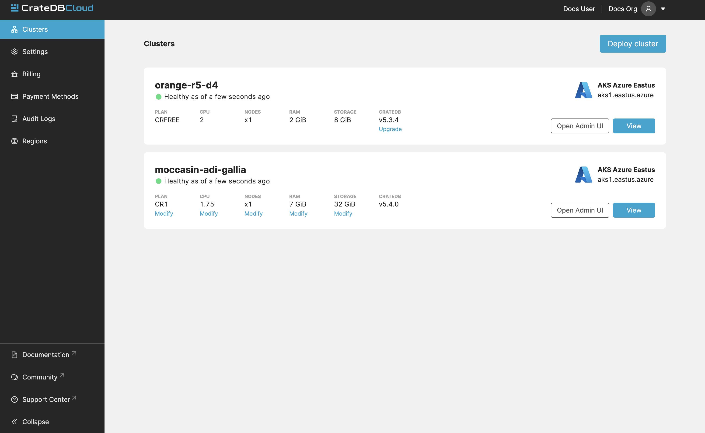
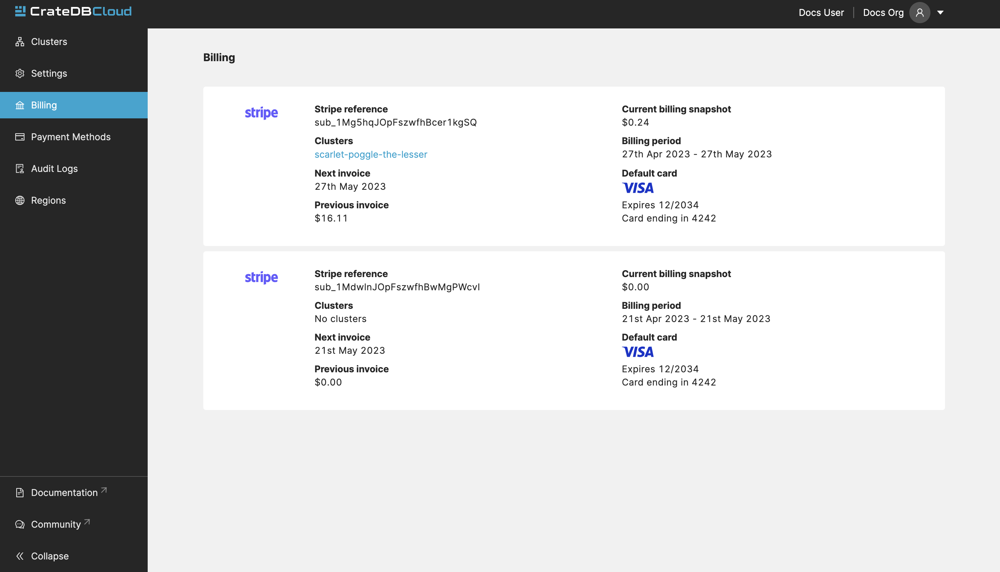
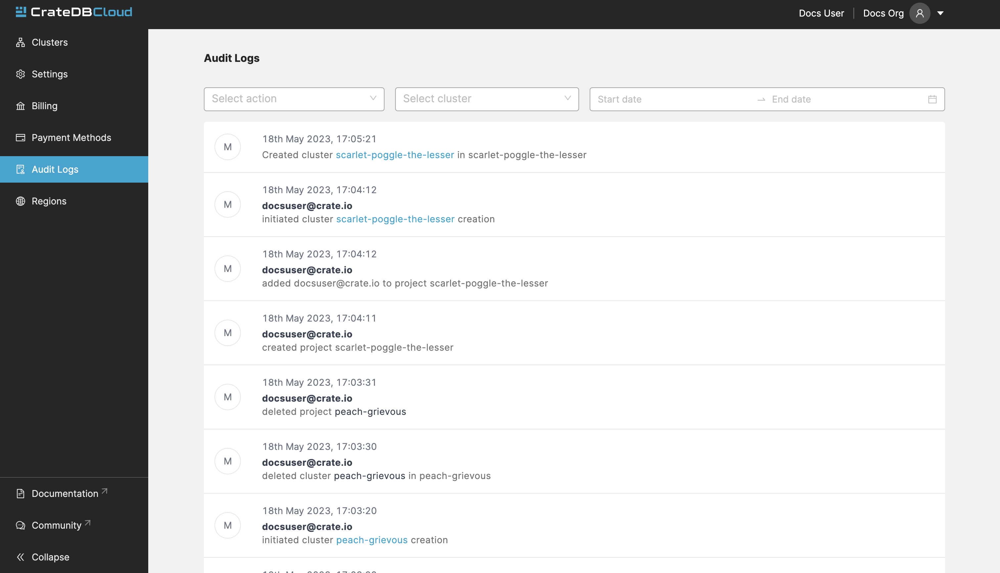
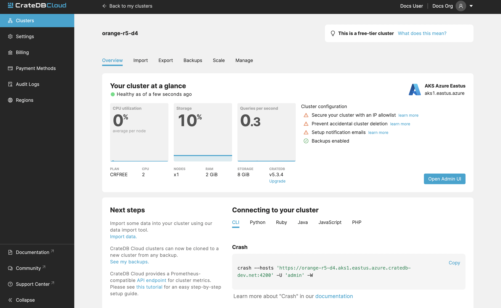
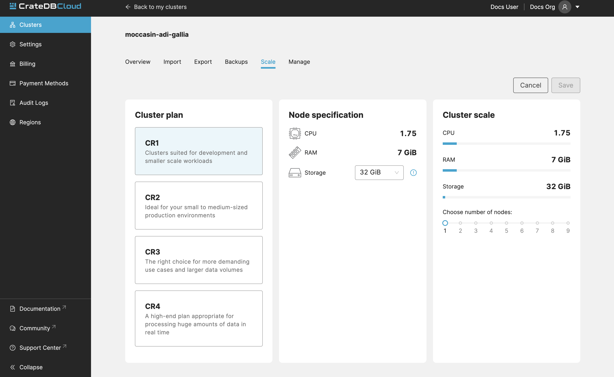
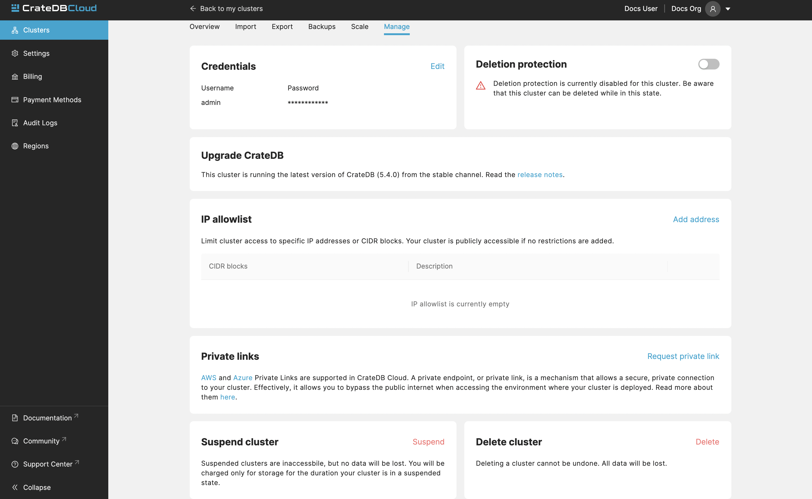

.. _overview:

================
Console overview
================

The *CrateDB Cloud Console* is a hosted web administration interface for
interacting with `CrateDB Cloud`_. This overview gives you all the basic
information for using the CrateDB Cloud Console. If you ever want to find
where and how to do something in the Console, start here. Refer to individual
items in the current section of the documentation for more information on how
to perform specific operations. You can also refer to our `glossary`_ for more
information on CrateDB Cloud-related terminology.

.. rubric:: Table of contents

.. contents::
   :local:

.. _overview-basics:

Basics
======

.. image:: _assets/img/start.png
   :alt: CrateDB Cloud sign-in screen

The CrateDB Cloud user interface permalink is the `CrateDB Cloud Console`_.
You can `deploy a trial cluster on the CrateDB Cloud Console for free`_.

Here is a list of all currently available regions for CrateDB Cloud:

+-------------------+----------------------------------------+
| Region            | URL                                    |
+===================+========================================+
| AWS West Europe   | `eks1.eu-west-1.aws.cratedb.cloud`_    |
+-------------------+----------------------------------------+
| Azure East-US2    | `aks1.eastus2.azure.cratedb.cloud`_    |
+-------------------+----------------------------------------+
| Azure West Europe | `aks1.westeurope.azure.cratedb.cloud`_ |
+-------------------+----------------------------------------+

Azure East-US2 and Azure West-Europe are managed by `Microsoft Azure`_. The
AWS region is managed by AWS and is located in Ireland. Note that the AWS
region does not serve the CrateDB Cloud Console directly.

From the Cloud Console homepage, you can sign in using a Github, Google, or
Microsoft Azure account or by creating a separate username and password.

If you don't have a Cloud Console account yet, follow the steps in the `signup
tutorial`_. Select the authentication method you wish to use. From there, you
will be given the option to sign up.

Once signed in, you will be presented with the Organization overview.

.. _overview-org-overview:

Organization
============

The organization is the highest structure in your CrateDB Cloud Console.
Multiple clusters and users can exist in a organization at any moment. For 
first-time users, an organization called "My organization" is automatically 
created upon first login.

To see a list of all the organizations you have acesss to, go to 

the My Account page in the dropdown menu in the top-right.

.. image:: _assets/img/organization-dashboard.png
   :alt: Cloud Console organization overview

The Organization overview consists of seven tabs: *Clusters*, *Settings*, 
*Billing*, *Payment Methods*, *Audit Logs*, and *Regions*. By default
you are brought to the Clusters tab, which provides a quick overview of all
your clusters.

If you are a member of multiple organizations, you can quickly change
between them on every tab/page in the Cloud Console. Simply use the
dropdown menu at the top-right of the current page/tab: 

.. image:: _assets/img/change-organization.png
   :alt: Cloud Console quick org swap

The CrateDB Cloud Console is structured on a per-organization basis: all pages
and tabs in the Console will display values for the currently selected
organization.

.. _overview-general-settings:

Settings
--------

The Settings tab shows you the name, notification settings, and ID of your
currently selected organization.

By clicking the *Edit* button next to the organization, you can rename it. 
Here you can also set the email address for notifications and indicate whether
you want to receive them or not.

It also shows a list of users in your organization. You can add new users by
clicking the "Add user" button. You can also choose the role of a new user. 
To learn more about user roles and their meaning, see our documentation 
on `user roles`_.

.. _overview-org-billing:

Organization Billing
--------------------

The Billing tab shows all your existing subscriptions, along with which
cluster is currently using the subscription. The current accumulated billing
snapshot is also visible here, along with additional information:

.. NOTE::
    Subscriptions cannot be deleted in the billing tab. To delete a
    subscription, please contact support.

.. _overview-org-payment-methods:

Organization payment methods
----------------------------

This tab shows all the information about your payment methods. If you have
signed up with a credit card for your cluster (the recommended route), your
card information overview will be shown here.

In case you use multiple cards, a default card can be set and cards can be
deleted from the list by using the dots icon to the right of the card listing.
Click the *Add payment method* button at the top right to add a new card.

Cloud subscription payment methods can also be added here.

.. image:: _assets/img/payment-methods2.png
   :alt: Cloud Console payment methods

.. _overview-org-audit:

Organization Audit Logs
-----------------------

This tab shows the Audit Logs of the current organization.

In the Audit Log, a user with the correct credentials (`an organization
admin`_) can see an overview of logged changes to the organization.

.. _overview-org-regions:

Organization Regions
--------------------

In this tab, you will see the available :ref:`regions <gloss-region>` for
cluster deployment. It is possible to deploy clusters on this screen as well,
by clicking the *Deploy cluster* button under each respective region field.

For those with access to `CrateDB Edge`_, this tab also allows the deployment
of :ref:`CrateDB Edge <gloss-edge>` clusters in a :ref:`custom region
<gloss-region>`. To do so, provide a name for the custom region and click the
*Create edge region* button. Once created, the custom region will appear:

This field will show a script to set up the dependencies for cluster
deployment in the custom region. Apply the script in your local CLI and follow
the prompts to proceed. A ``--help`` parameter is available within the script
for further information.

.. _overview-cluster-overview:

Cluster
=======

The detailed view of Cluster provides a broad range of relevant data of the
selected cluster. It also displays metrics for the cluster. It can be accessed
by clicking "View" on the desired cluster in the Clusters tab.

Information visible on the Overview page includes:

Overview
--------

* **Status**: Current status of your cluster:
   
   - GREEN: Your cluster is healthy.
   - YELLOW: Some of your tables have under-replicated shards. Please log in
     to your cluster's Admin UI to check.
   - RED: Some of your tables have missing shards. This can happen if you've
     recently restarted a node. Our support team is already notified and
     investigating the issue.

* **Region**: Name of the region where the cluster is deployed.

* **Plan**: This shows what subscription plan the cluster is running on. For
  more information on our plans, see the documentation on
  `subscription plans`_.

* **CPU metrics**: Current CPU utilization of the cluster.

* **Number of nodes**: Number of nodes in the cluster.

* **RAM metric**: Amount of memory of your cluster.

* **Storage metrics**: Used and overall storage of the cluster.

* **Version**: This indicates the version number of CrateDB the cluster is
  running.

* **Query metric**: Queries per second.

.. _overview-cluster-overview-admin-ui:

Admin UI
~~~~~~~~

* **Access cluster**: The *Open Admin UI* button connects you to
  the `CrateDB Admin UI`_ for the cluster at its unique URL.

.. NOTE::

    The Cluster URL points to a load balancer that distributes traffic
    internally to the whole CrateDB cluster. The load balancer closes idle
    connections after four minutes, therefore client applications that require
    stateful connections (e.g., JDBC) must be configured to send keep-alive
    heartbeat queries.

.. _overview-cluster-overview-next-steps:

Next Steps
~~~~~~~~~~

* **Import Data**: Import some data into your cluster using our data import 
tool.

* **See my backups**: CrateDB Cloud clusters can now be cloned to a new 
cluster from any backup.

* **API endpoint**: CrateDB Cloud provides a Prometheus-compatible API 
endpoint for cluster metrics.

For more information on the CrateDB concepts used here, refer to the `CrateDB
architecture documentation`_ or the :ref:`glossary<glossary>`.

.. _overview-connect-to-your-cluster:

Connecting to your cluster
~~~~~~~~~~~~~~~~~~~~~~~~~~

Here you can see a list of snippets for the available clients and libraries. 
These include: CLI, Python, Ruby, Java, JavaScript, PHP.

.. _overview-cluster-overview-access:

.. _overview-cluster-data:

Data
----

In the Data tab, users can conveniently import data from a URL, or from a 
file.

.. _overview-cluster-data-url:

Import from URL
~~~~~~~~~~~~~~~

.. image:: _assets/img/cluster-data-tab.png
   :alt: Cloud Console cluster data tab

Here you can choose between the Import from URL and Import from file. To 
import from a URL, click the Import from a URL button:

.. image:: _assets/img/cluster-data-tab-url.png
   :alt: Cloud Console cluster upload from url

To import data, fill out the URL, name of the table which will be created and
populated with your data, data format, and whether it is compressed.

If a table with the chosen name doesn’t exist, it will be automatically 
created. Please note that in this case, the importer will attempt to guess 
the data types of each column and might do so sub-optimally.

The following data formats are supported:

- CSV
- JSON
- Parquet

Gzip compressed files are also supported.

.. _overview-cluster-data-file:

Import from a file
~~~~~~~~~~~~~~~~~~

Uploading directly from your computer offers more control over your data.
From the security point of view, you don’t have to share the data on the 
internet just to be able to import it to your cluster. You also have more 
control over who has access to your data.

.. image:: _assets/img/cluster-data-tab-file.png
   :alt: Cloud Console cluster upload from file

As with the URL import, CSV, JSON, and Parquet files are supported. There is 
also a limit to file size, currently 1GB.

.. NOTE::

    - CSV files must have a header, otherwise the first row will be used as
      headers.
    - For JSON files, only "document-per-line" is supported, as defined in 
      https://jsonlines.org/
    - Additionally for JSON files, each line must be a JSON document (arrays 
      not supported)

.. _overview-cluster-backups:

Backups
-------

You can find the Backups page in the detailed view of your cluster. By
default, a backup is made every hour. You can see and restore all existing
backups here.

The Backups tab provides a list of all your backups. By default, a backup is
made every hour.

.. image:: _assets/img/cluster-backups.png
   :alt: Cloud Console cluster backups page

You can also control the schedule of your backups by clicking the *Edit backup
schedule* button.

.. image:: _assets/img/cluster-backups-edit.png
   :alt: Cloud Console cluster backups edit page

Here you can create a custom schedule by selecting any number of hour slots.
Backups will be created at selected times. At least one backup a day is
mandatory.

To restore a particular backup, click the *Restore* button. A popup window
with a SQL statement will appear. Input this statement to your Admin UI
console eitheir by copy-pasting it, or clicking the *Run query in Admin UI*.
The latter will bring you directly to the Admin UI console with the statement
automatically pre-filled.

.. image:: _assets/img/cluster-backups-restore.png
   :alt: Cloud Console cluster backups restore page

.. _overview-cluster-cloning:

Cluster Cloning
~~~~~~~~~~~~~~~

Cluster cloning is a process of duplicating all the data from a
specific snapshot into a different cluster. Creating the new cluster isn't
part of the cloning process, you need to create the target cluster yourself. 
You can clone a cluster from the Backups page. 

.. image:: _assets/img/cluster-backups.png
   :alt: Cloud Console cluster backup snapshots

Choose a snapshot and click the *Clone* button. A popup window will appear,
where you can specify to which existing cluster the snapshot should be cloned.
If you don't have a second cluster created, click the *Deploy a new cluster*
button, and you will be brought to the cluster deployment screen. After you've
selected a cluster, click the *Clone to selected cluster*. 

.. image:: _assets/img/cluster-clone-popup.png
   :alt: Cloud Console cluster clone popup

.. NOTE::

    Keep in mind that cloning a cluster will rewrite all the existing users
    from the target cluster. The tables already existing on the target cluster
    are not affected. Cloning also doesn't distinguish between cluster plans,
    meaning you can clone from CR2 to CR1 or any other variation.

.. _overview-cluster-cloning-fail:

Failed cloning
~~~~~~~~~~~~~~

There are circumstances under which cloning can fail or behave unexpectedly.
These are:

* If you already have tables with the same names in the target cluster
  as in the source snapshot, the entire clone operation will fail.

* There isn't enough storage left on the target cluster to accommodate the
  tables you're trying to clone. In this case, you might get an incomplete
  cloning as the cluster will run out of storage.

* You're trying to clone an invalid or no longer existing snapshot. This can
  happen if you're cloning through `Croud`_. In this case, the cloning will
  fail.

* You're trying to restore a table that is not included in the snapshot. This
  can happen if you're restoring snapshots through `Croud`_. In this case, 
  the cloning will fail.

When cloning fails, it is indicated by a banner in the cluster overview
screen.

.. image:: _assets/img/cluster-clone-failed.png
   :alt: Cloud Console cluster failed cloning

.. _overview-cluster-settings-scale:

Scale
-----

On the Scale tab, current configuration of your cluster is shown. You can see
your current plan, resources of a single node, and overall resources of the
cluster.

.. image:: _assets/img/cluster-scale.png
   :alt: Cloud Console cluster scaling tab

You can scale your cluster by clicking the *Edit cluster configuration* button
in the top-right:

Now you can do three different things:

- Change the plan of your cluster
- Increase storage on each node
- Icrease/decrease the number of nodes

You can do only one of those operations at a time, i.e. you can't change plans
and scale the number of nodes at the same time.

The difference in price of the cluster can be seen on the bottom right, when
choosing different configurations.

.. NOTE::

    Any promotions or discounts applicable to your cluster will be applied for
    your organization as a whole at the end of the billing period. Due to
    technical limitations, they may not be directly visible in the cluster
    scale pricing shown here, but do not worry! This does not mean that your
    promotion or discount is not functioning.

.. WARNING::

    Storage capacity increases for a given cluster are irreversible. To reduce
    cluster storage capacity, reduce the cluster nodes instead (up to a
    minimum of 2, although we recommend maintaining a minimum of 3 for
    production use).

.. _overview-cluster-manage:

Manage
------

The manage tab contains credentials settings, deletion protection, upgrades, 
IP allowlist, private links, suspend cluster, and delete cluster options.

**Credentials** - These are the username and password used for accessing the
Admin UI of your cluster. Username is always admin and the password can be
changed.

**Deletion protection** - While this is enabled, your cluster cannot be
deleted.

**Upgrades** - Here you can enable the CrateDB version running on your 
cluster.

**IP Allowlist** - By using the IP allowlisting feature, you can restrict 
access to your cluster to an indicated IP address or `CIDR block`_. Click the
blue *Add Address* button and you can fill out an IP address or range and give
it a meaningful description. Click *Save* to store it or the bin icon to 
delete a range. Keep in mind that once IP allowlisting has been set, you 
cannot access the Admin UI for that cluster from any other address.

If no allowlist address or address range is set, the cluster is publicly
accessible by default. (Of course, the normal authentication procedures are
always required.) Only an :ref:`org admin <org-roles>` can change the
allowlist.

**Private links** - A private endpoint, or private link, is a mechanism that 
allows a secure,  private connection to your cluster. Effectively, it allows
you to bypass the public internet when accessing the environment where your
cluster is deployed. Note that private endpoints don't work accross providers,
meaning that if you want to securely access your AWS cluster, you must do so
from within the AWS environment.

.. _overview-docs:

Documentation
=============

The Documentation link takes you directly to the CrateDB Cloud documentation,
which you are reading right now!

.. _overview-community:

Community
=========

The Community link goes to the `CrateDB and CrateDB Cloud Community page`_.
Here you can ask members of the community and Crate.io employees questions
about uncertainties or problems you are having when using our products.

.. _aks1.eastus2.azure.cratedb.cloud: https://eastus2.azure.cratedb.cloud/
.. _eks1.eu-west-1.aws.cratedb.cloud: https://eks1.eu-west-1.aws.cratedb.cloud
.. _aks1.westeurope.azure.cratedb.cloud: https://aks1.westeurope.azure.cratedb.cloud/
.. _an organization admin: https://crate.io/docs/cloud/reference/en/latest/user-roles.html#organization-roles
.. _bregenz.a1.cratedb.cloud: https://bregenz.a1.cratedb.cloud/
.. _CIDR block: https://www.keycdn.com/support/what-is-cidr
.. _concepts: https://crate.io/docs/cloud/reference/en/latest/concepts.html
.. _CrateDB Admin UI: https://crate.io/docs/clients/admin-ui/
.. _CrateDB and CrateDB Cloud Community page: https://community.crate.io/
.. _CrateDB architecture documentation: https://crate.io/docs/crate/howtos/en/latest/architecture/shared-nothing.html
.. _CrateDB Cloud: https://crate.io/products/cratedb-cloud/
.. _CrateDB Cloud Console: https://console.cratedb.cloud
.. _CrateDB Cloud support: support@crate.io
.. _CrateDB Edge: https://crate.io/products/cratedb-edge/
.. _CrateDB Edge region: https://crate.io/docs/cloud/tutorials/en/latest/edge/index.html
.. _Croud: https://crate.io/docs/cloud/cli/en/latest/
.. _Croud clusters upgrade: https://crate.io/docs/cloud/cli/en/latest/commands/clusters.html#clusters-upgrade
.. _deploy a trial cluster on the CrateDB Cloud Console for free: https://crate.io/lp-free-trial
.. _glossary: https://crate.io/docs/cloud/reference/en/latest/glossary.html
.. _HTTP: https://crate.io/docs/crate/reference/en/latest/interfaces/http.html
.. _Microsoft Azure: https://azure.microsoft.com/en-us/
.. _organization creation process: https://crate.io/docs/cloud/howtos/en/latest/create-org.html
.. _our tutorial on direct cluster deployment: https://crate.io/docs/cloud/tutorials/en/latest/cluster-deployment/stripe.html
.. _PostgreSQL wire protocol: https://crate.io/docs/crate/reference/en/latest/interfaces/postgres.html
.. _scaling the cluster: https://crate.io/docs/cloud/howtos/en/latest/scale-cluster.html
.. _signup tutorial: https://crate.io/docs/cloud/tutorials/en/latest/sign-up.html
.. _subscription plans: https://crate.io/docs/cloud/reference/en/latest/subscription-plans.html
.. _tutorial: https://crate.io/docs/cloud/tutorials/en/latest/cluster-deployment/index.html
.. _user roles: https://crate.io/docs/cloud/reference/en/latest/user-roles.html