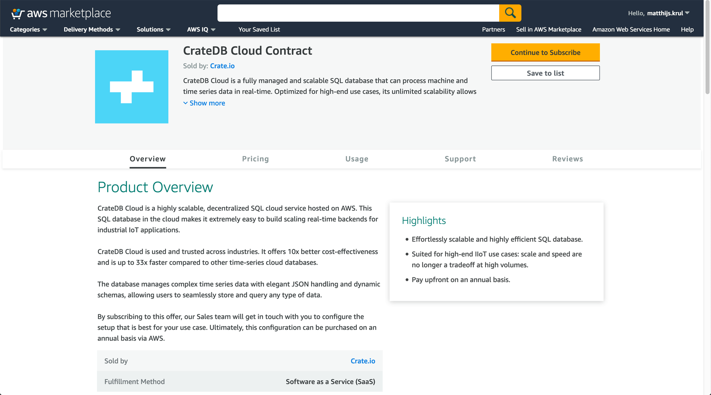

.. _subscription-plans:

==================
Subscription plans
==================

When signing up for the CrateDB Cloud service, you have a choice of five
different subscription plans. Each plan is preconfigured for different use
cases, depending on what your needs are. At the same time, the plans also offer
elasticity, since your use case may change. Within a given plan you can
horizontally scale the compute capacity of your cluster(s) up or down by adding
or subtracting nodes. Limited vertical scaling is also possible, with
storage scaling (up only). For information on how to do this, refer to our
`scaling guide`_.

The nature of our plans depends on the method of your subscription. We will
first explain the plans for the recommended subscription method, `subscribing
and deploying a cluster directly`_. Subsequently, we will provide some more
detailed information regarding plans and billing for subscriptions via our
Marketplace SaaS offers.

.. rubric:: Table of contents

.. contents::
   :local:

.. _subscription-plans-stripe:

CrateDB Cloud subscription plans
================================

The standard CrateDB Cloud deployment process offers five subscription plans,
labeled CR0 to CR4. Each of these plans consists of two dimensions: compute
and storage. The compute configuration is set for each plan, but can be scaled
horizontally by adding or subtracting nodes during or after deployment. Storage
is configured separately: on deployment you can set the desired storage
capacity for your cluster, within the range of storage capacity options
provided for that plan. Storage can also be scaled up, but cannot be lowered
after that. To view the current plans, prices, and compute and storage ranges,
refer to our `pricing page`_.

For details on signup, cluster configuration, and cluster deployment, you can
make use of our `deployment tutorial`_.

.. NOTE::
    `CrateDB Edge`_ works differently. Since it allows hosting CrateDB Cloud
    on your local or self-service Kubernetes stack, there is no need for
    different subscription plans. You can combine CrateDB Edge with any
    suitable hardware configuration that works for your use case.

.. WARNING::
    CrateDB Cloud does not currently support changing the storage capacity of
    a cluster once it has been deployed. Additionally, a single node cluster,
    once scaled up, cannot be scaled down to one node again.

Although you can scale your cluster from a single node to as many nodes as
desired, only clusters containing 3 or more nodes are covered by our 24/7
support. You can find our CrateDB Cloud terms and conditions in our `SLA`_.

.. _subscription-plans-regions:

Subscription plan regions
=========================

We currently offer three :ref:`regions <gloss-region>` for our subscriptions:
one from AWS (West Europe) and two from Azure (East US 2 and West Europe). You
can use any subscription plan in any region. Note that prices for a given plan
differ depending on the region you select.

.. _subscription-plans-nodes:

Subscription plan nodes
=======================

For all subscriptions, the number of nodes in a cluster can be adjusted
manually. You can `scale your cluster`_ any time in the CrateDB Cloud Console
to up to 9 nodes. (If you need more nodes than this, you can `contact us`_ any
time.)

.. WARNING::

    An even number of nodes can be used for testing and development without
    issue, but is not recommended for production workloads, due to the risk of
    `split-brain syndrome`_.

.. _subscription-plans-marketplace:

CrateDB Cloud SaaS offer plans
==============================

In this section, we explain the plans and billing for our SaaS Marketplace
offers on `AWS Marketplace`_ and `Azure Marketplace`_. The below information
applies to these Marketplace subscriptions only. This reference gives a
brief description of the plans and subsequently explains the meaning and usage
of nodes, tiers, and DTUs for Marketplace subscriptions. This makes it easy to
choose the right setup for your CrateDB Cloud SaaS subscription.

CrateDB Cloud's SaaS offer comes with five different subscription plans:
**Development**, **General Purpose**, **I/O Optimized**, and **Storage
Optimized**. Besides these, we also offer the CrateDB Cloud **Contract**.

* The **Development** plan is aimed at users who want to try out what CrateDB
  Cloud has to offer. It offers modest but robust storage, memory, and
  computation capacity. Although intended for setting up trial clusters to
  evaluate the product, it offers full flexibility and functionality. The
  capacity can be scaled along three scale units. Per scale unit, one DTU is
  added (or subtracted).

.. NOTE::

    The **Development** plan is not covered by 24/7 support.

* The **General Purpose** plan suits all general use cases. This plan offers
  significant storage, memory, and computation capacity. The General Purpose
  plan can also currently be scaled between three scale units, each adding (or
  subtracting) one DTU.

* The **I/O Optimized** plan is, as the name suggests, optimized for write and
  query speed. It offers double the capacity for inserts and queries per second
  of the **General Purpose** plan, but does not increase storage capacity.

* The **Storage Optimized** plan is, by contrast, suited for use cases that are
  primarily about (warm) storage and have less emphasis on querying. It offers
  half the insert and query capacity of the **General Purpose** plan, but four
  times the storage capacity.

.. _subscription-plans-tiers:

SaaS offer tiers
================

Besides the hardware composition described above, which outlines the ratio of
the elements CPU, RAM, and storage HD for each SaaS Marketplace subscription
plan, each such plan can have two further dimensions: tiers and nodes.

Tiers are only used for Marketplace SaaS subscriptions. Tiers are simply
multiples of each hardware composition, and therefore allow vertical scaling
within a given plan. For example, the Basic tier of the **General Purpose**
plan has 3.5 CPUs, 14 GiB of RAM, and 1 TiB of storage. The next tier of that
plan, the Pro tier, has 7 CPUs, 28 GiB of RAM, and 2 TiB of storage, and so
forth. The **Development** plan differs from the others: it has only a single
tier and allows scaling between 1-3 nodes only.

Each node, in turn, corresponds to one DTU, regardless of tier. Put simply, the
tier determines the hardware 'size' of the node, the number of nodes determines
the number of DTUs at that size. Since the Development plan starts at 1 node,
it starts at 1 DTU; other plans start at 3 nodes and therefore start at 3 DTUs.

If you use our SaaS Marketplace offers, you will encounter DTUs/hour as the
measure of actual usage that we bill for. If you subscribe to CrateDB Cloud
directly via credit card, you do not have to concern yourself with DTUs. For a
more detailed explanation of DTUs, see the section below.

.. _subscription-plans-dtus:

Explaining DTUs for scaling and billing
=======================================

What are DTUs and how do they work? As mentioned above, to make finding the
right combination of hardware capacity more tractable and accessible, CrateDB
Cloud's SaaS offers use DTUs. These DTUs have essentially two purposes: they
allow the user to choose the right combination of plan and scale to find the
capacity they need, and they provide clarity for the purposes of pricing. In
order to keep things simple, scaling in each plan is currently set up so that
one scale unit = one node = one DTU, and billing is set up so that Crate.io
bills only for DTUs/hour actually used.

Let's break this down further to clarify what each of these statements mean.

As seen above, CrateDB Cloud's SaaS offer is divided into five plans. Each
plan has a starting number of nodes (usually 3), that can be scaled to a larger
number (between 4 and 15). Because the hardware capacity in each plan and tier
is different, a node of the **GP** plan at the **Basic** tier, for example, is
of a different size (in terms of storage, memory, and computation) than a node
in the **I/O Optimized** plan at tier Premium. But the billing for these varied
hardware compositions and scales is made easy by the fact that for any given
plan and tier, one node corresponds to one DTU. Since for SaaS Marketplace
users we bill in terms of DTUs/hour, all the different dimensions of horizontal
and vertical hardware scaling are resolved into a single measure.

An overview showing the range in terms of capacity of each SaaS plan and the
price per DTU/hour can be found on the `Azure offer page`_ and the `AWS
subscription page`_, respectively. All details about each hardware dimension,
plan, tier, and node, can also be found on the deployment screen in the CrateDB
Cloud console when deploying your cluster.

To summarize:

The DTU approach to scaling means that although the offered plans differ
considerably in capacity per plan, tier, and number of nodes, the DTU system
allows you to easily compare these different magnitudes for a single usage
price on the SaaS Marketplaces.

The precise calculations of hardware capacity, actual usage of that hardware,
and a corresponding cost are all handled by Crate.io. The user only needs to
choose a plan, a tier within that plan, and the number of nodes. You will then
know the price in DTU/hour that corresponds to your choice.

.. _subscription-plans-contracts:

The CrateDB Cloud Contract
==========================

The **CrateDB Cloud Contract** allows you to pay for a full year's worth of the
service of your choice in advance. You purchase a certain number of DTUs for
one of the subscription plans mentioned above, and pay them up front for the
full year. Depending on the specifics of the contract chosen, it may be
possible to negotiate a discount based on the up front payment. The CrateDB
Cloud Contract is only available via our supported cloud providers on the SaaS
Marketplaces. For more information, contact our `Sales team`_.

The process depends on whether you sign up via Azure or via AWS, as described
below:

Azure
-----

To sign a CrateDB Cloud Contract via Microsoft Azure, follow the :ref:`initial
steps for signup <cloud-tutorials:signup-azure-to-cluster-offer>` while
selecting the CrateDB Cloud Contract as your subscription plan. This will
automatically alert our Sales team, who will get in touch with you to configure
the specifics of your contract according to your needs.

AWS
---

To sign a CrateDB Cloud Contract via AWS, simply follow the link to the
`Contract page on the AWS Marketplace`_. The Contract will be visible as a
product you can subscribe to. The pricing information is indicative of the cost
of a single DTU for a given subscription plan (see the descriptions of the
plans above) for the full year.

By subscribing to the CrateDB Cloud Contract product, you will automatically be
put in contact with our `Sales department`_, which will further help you
configure the right plan and contract according to your needs.

.. _subscription-plans-notes:

Cautionary notes
================

For clarity, we add here a few notes of caution:

* The correspondence between one node and one DTU is provisional and may change
  in the future.
* Remember that not all SaaS plans, currently or in the future, necessarily
  *start* at one DTU. All plans except the **Development** plan currently start
  at three DTUs of that plan. Therefore, when referring to the pricing per
  DTU/hour on the SaaS Marketplace cloud offer, keep this in mind. The price
  for a single DTU/hour, as listed on the cloud offer pages, is not necessarily
  the minimum price for an hour usage of a given plan.
* New plans may be offered in the future with different capacity ranges that
  may suit your use case. This reference document will then be updated
  accordingly. Plan terms and prices are subject to change.

.. _AWS Marketplace: https://aws.amazon.com/marketplace/pp/B089M4B1ND
.. _AWS subscription page: https://aws.amazon.com/marketplace/pp/B089M4B1ND
.. _Azure Marketplace: https://azuremarketplace.microsoft.com/en-us/marketplace/apps/crate.cratedbcloud?tab=PlansAndPrice
.. _Azure offer page: https://azuremarketplace.microsoft.com/en-us/marketplace/apps/crate.cratedbcloud?tab=Overview
.. _contact us: sales@crate.io
.. _Contract page on the AWS Marketplace: https://aws.amazon.com/marketplace/pp/B08KHK34RK
.. _CrateDB Edge: https://crate.io/products/cratedb-edge/
.. _deployment tutorial: https://crate.io/docs/cloud/tutorials/en/latest/cluster-deployment/stripe.html
.. _pricing page: https://crate.io/pricing
.. _Sales department: sales@crate.io
.. _Sales team: sales@crate.io
.. _scale your cluster: https://crate.io/docs/cloud/howtos/en/latest/reconfigure-cluster.html
.. _scaling guide: hhttps://crate.io/docs/cloud/howtos/en/latest/reconfigure-cluster.html
.. _SLA: https://crate.io/legal/service-level-agreement
.. _split-brain syndrome: https://en.wikipedia.org/wiki/Split-brain_(computing)
.. _subscribing and deploying a cluster directly: https://crate.io/docs/cloud/tutorials/en/latest/cluster-deployment/stripe.html